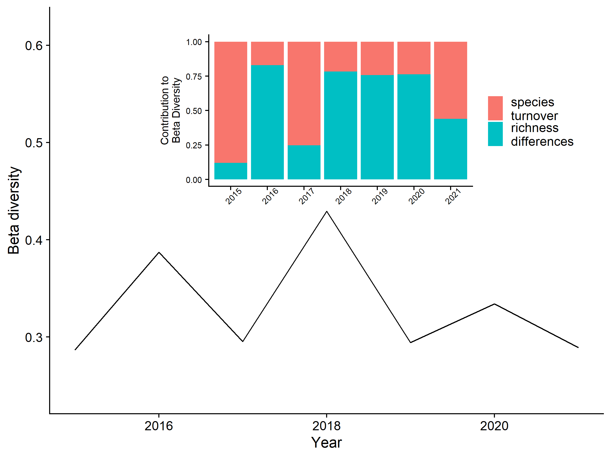

BeeSearch initial
================
Dr. Riley M. Anderson
June 14, 2024

  

- [Overview](#overview)
  - [Summary of Results](#summary-of-results)
- [How many species do we have at each location? How much variability is
  there in
  richness?](#how-many-species-do-we-have-at-each-location-how-much-variability-is-there-in-richness)
  - [Rarefaction curves:](#rarefaction-curves)
- [What bee groups drive changes in abundance from early to mid to late
  year?](#what-bee-groups-drive-changes-in-abundance-from-early-to-mid-to-late-year)
- [Can we do analysis with and without major species (H. tripartitus; A.
  texanus; M.
  microsticta/us)](#can-we-do-analysis-with-and-without-major-species-h-tripartitus-a-texanus-m-microstictaus)
  - [- Is there anything we can do to figure out why these species are
    abundant in certain
    year?](#--is-there-anything-we-can-do-to-figure-out-why-these-species-are-abundant-in-certain-year)
- [What is the turnover of species within sub-sites within
  years?](#what-is-the-turnover-of-species-within-sub-sites-within-years)
- [What is the turnover of species within major sites across
  years?](#what-is-the-turnover-of-species-within-major-sites-across-years)
- [How similar are populations within sites based on distance (spatial
  autocorrelation), and can we assess this for particular bee
  groups](#how-similar-are-populations-within-sites-based-on-distance-spatial-autocorrelation-and-can-we-assess-this-for-particular-bee-groups)
  - [Interesting groups: Osmia (lots of species, not abundant),
    Halictus](#interesting-groups-osmia-lots-of-species-not-abundant-halictus)
- [Can we assess why groups like Halictus have so much variability in
  abundance, and whether this has anything to do with the sex of the
  individuals
  collected?](#can-we-assess-why-groups-like-halictus-have-so-much-variability-in-abundance-and-whether-this-has-anything-to-do-with-the-sex-of-the-individuals-collected)
- [Is there greater overall diversity at SCL vs POS vs
  PBF?](#is-there-greater-overall-diversity-at-scl-vs-pos-vs-pbf)
- [Distance effects – can we estimate
  flight](#distance-effects--can-we-estimate-flight)
- [Can we compare to Eli’s study?](#can-we-compare-to-elis-study)
- [What species are persistent?](#what-species-are-persistent)
  - [Session Information](#session-information)

## Overview

What is this analysis about?

### Summary of Results

- 

# How many species do we have at each location? How much variability is there in richness?

<!-- -->

## Rarefaction curves:

What scale do we want?
<!-- --><!-- --><!-- --><!-- -->

# What bee groups drive changes in abundance from early to mid to late year?

NMDS 2017

    ## Permutation test for adonis under reduced model
    ## Terms added sequentially (first to last)
    ## Permutation: free
    ## Number of permutations: 999
    ## 
    ## adonis2(formula = nmds2017dist ~ meta2017$ToY)
    ##              Df SumOfSqs      R2     F Pr(>F)  
    ## meta2017$ToY  2   0.7970 0.12317 1.475  0.029 *
    ## Residual     21   5.6735 0.87683               
    ## Total        23   6.4704 1.00000               
    ## ---
    ## Signif. codes:  0 '***' 0.001 '**' 0.01 '*' 0.05 '.' 0.1 ' ' 1
    ## 
    ## Permutation test for homogeneity of multivariate dispersions
    ## Permutation: free
    ## Number of permutations: 999
    ## 
    ## Response: Distances
    ##           Df   Sum Sq   Mean Sq      F N.Perm Pr(>F)
    ## Groups     2 0.011462 0.0057310 1.7038    999  0.201
    ## Residuals 21 0.070636 0.0033636

Within the Port of Seattle sites in 2017, species composition changes
significantly throughout the season with distinct groups of species in
early, mid, and late season sampling.

<!-- -->
**Non-metric multidimensional scaling of bee species in Port of Seattle
in 2017.** Points are sub-sites within the port of Seattle in 2017. They
are separated by time of season with the 8 sub sites at the early season
in red, the same 8 sub sites at the middle season in blue, and the same
8 sub sites at the end of the season in green. The NMDS space represents
total bee species composition and the labels are specific bee species
and their position in NMDS space. Large points are the centroids (means)
of the points in NMDS space. Ellipses are 95% confidence intervals
around the centroids.

# Can we do analysis with and without major species (H. tripartitus; A. texanus; M. microsticta/us)

## - Is there anything we can do to figure out why these species are abundant in certain year?

# What is the turnover of species within sub-sites within years?

<!-- -->

# What is the turnover of species within major sites across years?

Can we answer this question if the sampling was not the same across
major sites?

# How similar are populations within sites based on distance (spatial autocorrelation), and can we assess this for particular bee groups

## Interesting groups: Osmia (lots of species, not abundant), Halictus

# Can we assess why groups like Halictus have so much variability in abundance, and whether this has anything to do with the sex of the individuals collected?

# Is there greater overall diversity at SCL vs POS vs PBF?

# Distance effects – can we estimate flight

# Can we compare to Eli’s study?

# What species are persistent?

## Session Information

    R version 4.2.3 (2023-03-15 ucrt)
    Platform: x86_64-w64-mingw32/x64 (64-bit)
    Running under: Windows 10 x64 (build 19045)

    Matrix products: default

    locale:
    [1] LC_COLLATE=English_United States.utf8 
    [2] LC_CTYPE=English_United States.utf8   
    [3] LC_MONETARY=English_United States.utf8
    [4] LC_NUMERIC=C                          
    [5] LC_TIME=English_United States.utf8    

    attached base packages:
    [1] stats     graphics  grDevices utils     datasets  methods   base     

    other attached packages:
     [1] vegan_2.6-4     lattice_0.20-45 permute_0.9-7   cowplot_1.1.1  
     [5] lubridate_1.9.2 forcats_1.0.0   stringr_1.5.0   dplyr_1.1.1    
     [9] purrr_1.0.1     readr_2.1.4     tidyr_1.3.0     tibble_3.2.1   
    [13] ggplot2_3.5.0   tidyverse_2.0.0

    loaded via a namespace (and not attached):
     [1] tidyselect_1.2.0 xfun_0.38        splines_4.2.3    colorspace_2.1-0
     [5] vctrs_0.6.1      generics_0.1.3   htmltools_0.5.5  yaml_2.3.7      
     [9] mgcv_1.8-42      utf8_1.2.3       rlang_1.1.0      pillar_1.9.0    
    [13] glue_1.6.2       withr_2.5.0      lifecycle_1.0.3  munsell_0.5.0   
    [17] gtable_0.3.3     codetools_0.2-19 evaluate_0.20    labeling_0.4.2  
    [21] knitr_1.42       tzdb_0.3.0       fastmap_1.1.1    parallel_4.2.3  
    [25] fansi_1.0.4      highr_0.10       Rcpp_1.0.10      scales_1.3.0    
    [29] farver_2.1.1     hms_1.1.3        digest_0.6.31    stringi_1.7.12  
    [33] ggrepel_0.9.3    grid_4.2.3       rprojroot_2.0.3  cli_3.6.1       
    [37] tools_4.2.3      magrittr_2.0.3   cluster_2.1.4    pkgconfig_2.0.3 
    [41] MASS_7.3-58.2    Matrix_1.5-3     timechange_0.2.0 rmarkdown_2.21  
    [45] rstudioapi_0.14  R6_2.5.1         nlme_3.1-162     compiler_4.2.3  
