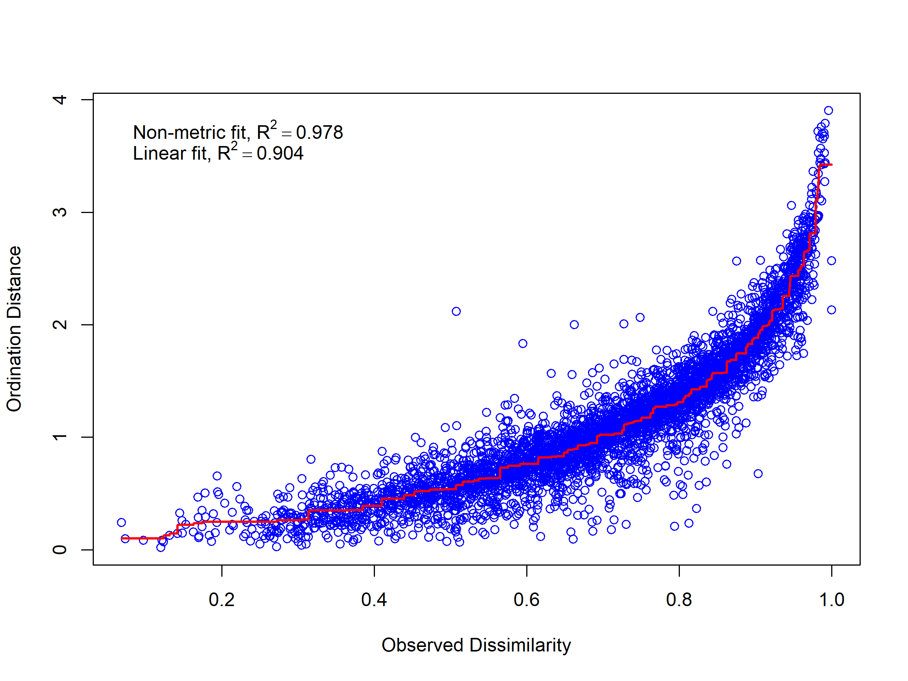
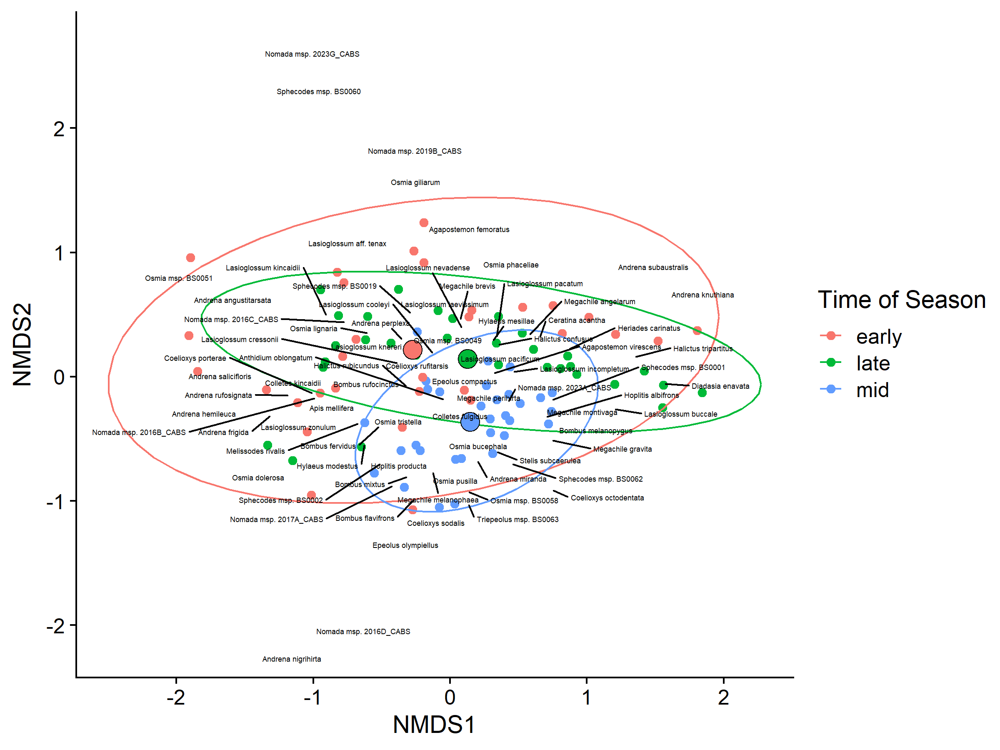
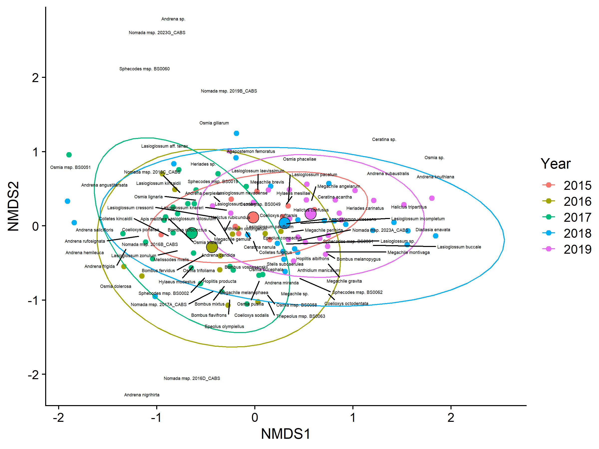
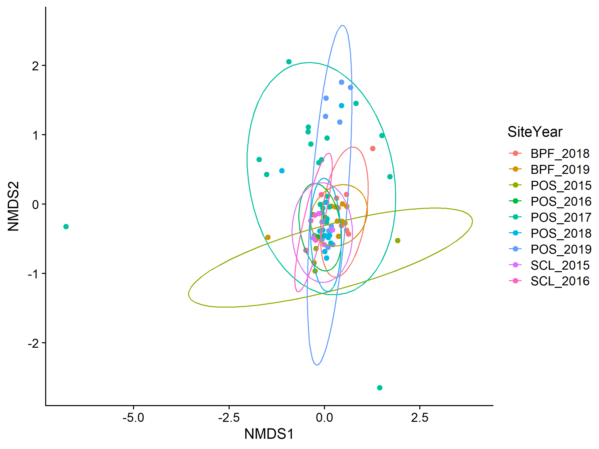

BeeSearch initial
================
Dr. Riley M. Anderson
July 15, 2024

  

- [Overview](#overview)
  - [Summary of Results](#summary-of-results)
- [How many species do we have at each location? How much variability is
  there in
  richness?](#how-many-species-do-we-have-at-each-location-how-much-variability-is-there-in-richness)
- [Sex ratio in trap vs. netting collection
  method:](#sex-ratio-in-trap-vs-netting-collection-method)
- [Chao indices](#chao-indices)
- [Does community composition change over
  time?](#does-community-composition-change-over-time)
- [How does community composition change across
  seasons?](#how-does-community-composition-change-across-seasons)
- [What bee groups drive changes in abundance from early to mid to late
  year?](#what-bee-groups-drive-changes-in-abundance-from-early-to-mid-to-late-year)
- [Can we do analysis with and without major species (H. tripartitus; A.
  texanus; M.
  microsticta/us)](#can-we-do-analysis-with-and-without-major-species-h-tripartitus-a-texanus-m-microstictaus)
- [What is the turnover of species within sub-sites within
  years?](#what-is-the-turnover-of-species-within-sub-sites-within-years)
- [Is there greater overall diversity at SCL vs POS vs
  PBF?](#is-there-greater-overall-diversity-at-scl-vs-pos-vs-pbf)
  - [Session Information](#session-information)

## Overview

What is this analysis about?

### Summary of Results

- 

# How many species do we have at each location? How much variability is there in richness?

<!-- --> This is purely species
counts, no kind of offset for sampling effort (other than excluding 2014
and 2020).

# Sex ratio in trap vs. netting collection method:

- Ratios \> 1 represent male bias

- Ratios \< 1 represent female bias

- Overall:

| Collection.Method | female | male | sex_ratio |
|:------------------|-------:|-----:|----------:|
| N                 |    737 |  421 |      0.57 |
| T                 |   6155 | 1497 |      0.24 |

- By site:

| Collection.Method | Site | female | male | sex_ratio |
|:------------------|:-----|-------:|-----:|----------:|
| N                 | BPF  |     61 |   92 |      1.51 |
| N                 | POS  |    624 |  272 |      0.44 |
| N                 | SCL  |     52 |   57 |      1.10 |
| T                 | BPF  |    751 |  278 |      0.37 |
| T                 | POS  |   4478 |  917 |      0.20 |
| T                 | SCL  |    926 |  302 |      0.33 |

- By season:

| Collection.Method | ToY   | female | male | sex_ratio |
|:------------------|:------|-------:|-----:|----------:|
| N                 | early |    129 |   82 |      0.64 |
| N                 | late  |    226 |  210 |      0.93 |
| N                 | mid   |    382 |  129 |      0.34 |
| T                 | early |   1471 |  322 |      0.22 |
| T                 | late  |   1461 |  415 |      0.28 |
| T                 | mid   |   3223 |  760 |      0.24 |

- By season and site:

| Collection.Method | ToY   | Site | female | male | sex_ratio |
|:------------------|:------|:-----|-------:|-----:|----------:|
| N                 | early | BPF  |     15 |   59 |      3.93 |
| N                 | early | POS  |    114 |   23 |      0.20 |
| N                 | late  | BPF  |     28 |   22 |      0.79 |
| N                 | late  | POS  |    198 |  186 |      0.94 |
| N                 | mid   | BPF  |     18 |   11 |      0.61 |
| N                 | mid   | POS  |    312 |   63 |      0.20 |
| N                 | mid   | SCL  |     52 |   55 |      1.06 |
| T                 | early | BPF  |    147 |   33 |      0.22 |
| T                 | early | POS  |    998 |  148 |      0.15 |
| T                 | early | SCL  |    326 |  141 |      0.43 |
| T                 | late  | BPF  |    190 |  108 |      0.57 |
| T                 | late  | POS  |   1058 |  260 |      0.25 |
| T                 | late  | SCL  |    213 |   47 |      0.22 |
| T                 | mid   | BPF  |    414 |  137 |      0.33 |
| T                 | mid   | POS  |   2422 |  509 |      0.21 |
| T                 | mid   | SCL  |    387 |  114 |      0.29 |
| N                 | late  | SCL  |      0 |    2 |       Inf |

# Chao indices

- Chao indices by site

|  chao1 |  chao2 | Site |
|-------:|-------:|:-----|
| 107.18 | 107.18 | BPF  |
| 192.06 | 192.06 | POS  |
| 120.13 | 120.13 | SCL  |

- Chao indices by site and season

|  chao1 |  chao2 | Site | Season |
|-------:|-------:|:-----|:-------|
|  54.00 |  54.00 | BPF  | early  |
|  95.50 |  95.50 | BPF  | late   |
|  90.45 |  90.45 | BPF  | mid    |
| 100.00 | 100.00 | POS  | early  |
|  76.90 |  76.90 | POS  | late   |
| 140.04 | 140.04 | POS  | mid    |
| 102.14 | 102.14 | SCL  | early  |
|  56.60 |  56.60 | SCL  | late   |
|  98.45 |  98.45 | SCL  | mid    |

- Chao indices by station

|  chao1 |  chao2 | Station |
|-------:|-------:|:--------|
|  44.64 |  44.64 | BPF1    |
|  68.67 |  68.67 | BPF2    |
|  34.33 |  34.33 | BPF3    |
|  95.00 |  95.00 | BPF4    |
|  58.00 |  58.00 | BPF5    |
|  55.12 |  55.12 | BPF6    |
|  40.56 |  40.56 | BPF7    |
|  31.67 |  31.67 | BPF8    |
|  47.00 |  47.00 | BPFX    |
|   3.00 |   3.00 | POS     |
|  98.72 |  98.72 | POS1    |
|   6.00 |   6.00 | POS1/5  |
|  20.00 |  20.00 | POS10   |
|  62.67 |  62.67 | POS11   |
| 136.25 | 136.25 | POS12   |
|  70.50 |  70.50 | POS13   |
|  45.25 |  45.25 | POS14   |
|  18.00 |  18.00 | POS15   |
|  46.00 |  46.00 | POS16   |
|  61.00 |  61.00 | POS17   |
|  26.00 |  26.00 | POS18   |
|  43.00 |  43.00 | POS19   |
| 119.08 | 119.08 | POS2    |
|  19.50 |  19.50 | POS2/3  |
| 103.00 | 103.00 | POS20   |
|  64.20 |  64.20 | POS21   |
|  45.33 |  45.33 | POS22   |
|  56.40 |  56.40 | POS23   |
|  69.00 |  69.00 | POS24   |
|  56.33 |  56.33 | POS25   |
|  48.00 |  48.00 | POS26   |
|  39.00 |  39.00 | POS27   |
|  26.90 |  26.90 | POS28   |
|  91.50 |  91.50 | POS3    |
|  70.06 |  70.06 | POS4    |
|  92.00 |  92.00 | POS5    |
|  61.33 |  61.33 | POS6    |
|   1.00 |   1.00 | POS6/7  |
|  33.33 |  33.33 | POS7    |
|   2.00 |   2.00 | POS7/8  |
|  85.75 |  85.75 | POS8    |
|  95.00 |  95.00 | POS9    |
|  45.08 |  45.08 | POSX    |
| 104.08 | 104.08 | SCL1    |
| 113.50 | 113.50 | SCL2    |
|  83.50 |  83.50 | SCL3    |
|  90.14 |  90.14 | SCL4    |
|  44.17 |  44.17 | SCL5    |

- Chao indices by station and year

|  chao1 |  chao2 | Station | Year |
|-------:|-------:|:--------|:-----|
|  52.50 |  52.50 | BPF1    | 2018 |
|  61.67 |  61.67 | BPF1    | 2019 |
|  45.00 |  45.00 | BPF2    | 2018 |
|  47.17 |  47.17 | BPF2    | 2019 |
|  32.00 |  32.00 | BPF3    | 2018 |
|  38.12 |  38.12 | BPF3    | 2019 |
|  27.75 |  27.75 | BPF4    | 2018 |
|  44.12 |  44.12 | BPF4    | 2019 |
|  32.10 |  32.10 | BPF5    | 2018 |
|  63.60 |  63.60 | BPF5    | 2019 |
|  24.08 |  24.08 | BPF6    | 2018 |
| 102.25 | 102.25 | BPF6    | 2019 |
|  40.56 |  40.56 | BPF7    | 2019 |
|  31.67 |  31.67 | BPF8    | 2019 |
|  11.00 |  11.00 | BPFX    | 2018 |
|  19.00 |  19.00 | BPFX    | 2019 |
|   6.00 |   6.00 | POS1/5  | 2017 |
|  22.17 |  22.17 | POS10   | 2017 |
|  10.00 |  10.00 | POS10   | 2019 |
|  42.67 |  42.67 | POS11   | 2017 |
|  14.25 |  14.25 | POS11   | 2018 |
|  30.12 |  30.12 | POS12   | 2017 |
|  75.50 |  75.50 | POS12   | 2019 |
|  58.50 |  58.50 | POS13   | 2017 |
|  52.67 |  52.67 | POS13   | 2018 |
|  55.50 |  55.50 | POS13   | 2020 |
|  45.25 |  45.25 | POS14   | 2017 |
|  18.00 |  18.00 | POS15   | 2017 |
|  46.00 |  46.00 | POS16   | 2017 |
|  61.00 |  61.00 | POS17   | 2017 |
|  26.00 |  26.00 | POS18   | 2017 |
|  43.00 |  43.00 | POS19   | 2017 |
|  30.06 |  30.06 | POS1    | 2014 |
|  43.08 |  43.08 | POS1    | 2015 |
|  55.17 |  55.17 | POS1    | 2016 |
|  16.00 |  16.00 | POS1    | 2017 |
|   6.00 |   6.00 | POS1    | 2018 |
|  84.00 |  84.00 | POS1    | 2019 |
|  19.50 |  19.50 | POS2/3  | 2015 |
|  13.00 |  13.00 | POS20   | 2017 |
|  53.06 |  53.06 | POS20   | 2018 |
|  18.50 |  18.50 | POS20   | 2019 |
|  40.56 |  40.56 | POS20   | 2020 |
|   6.00 |   6.00 | POS21   | 2017 |
|  64.20 |  64.20 | POS21   | 2019 |
|  46.00 |  46.00 | POS22   | 2018 |
|   9.50 |   9.50 | POS22   | 2019 |
|  55.40 |  55.40 | POS23   | 2018 |
|  31.25 |  31.25 | POS23   | 2019 |
|  79.00 |  79.00 | POS24   | 2018 |
|  24.60 |  24.60 | POS24   | 2020 |
|  56.33 |  56.33 | POS25   | 2019 |
|  48.00 |  48.00 | POS26   | 2020 |
|  39.00 |  39.00 | POS27   | 2020 |
|  26.90 |  26.90 | POS28   | 2020 |
|  36.00 |  36.00 | POS2    | 2014 |
|  60.07 |  60.07 | POS2    | 2015 |
|  86.17 |  86.17 | POS2    | 2016 |
|  39.25 |  39.25 | POS2    | 2019 |
|  39.12 |  39.12 | POS3    | 2014 |
|  50.17 |  50.17 | POS3    | 2015 |
|  48.90 |  48.90 | POS3    | 2016 |
|  50.33 |  50.33 | POS3    | 2018 |
|  57.25 |  57.25 | POS4    | 2016 |
|  45.00 |  45.00 | POS4    | 2018 |
|  48.06 |  48.06 | POS4    | 2020 |
|  90.25 |  90.25 | POS5    | 2017 |
|  56.00 |  56.00 | POS5    | 2019 |
|   1.00 |   1.00 | POS6/7  | 2017 |
|  70.25 |  70.25 | POS6    | 2017 |
|  47.00 |  47.00 | POS6    | 2019 |
|   2.00 |   2.00 | POS7/8  | 2017 |
|  33.33 |  33.33 | POS7    | 2017 |
|  45.00 |  45.00 | POS8    | 2017 |
|  67.90 |  67.90 | POS8    | 2019 |
| 144.50 | 144.50 | POS9    | 2017 |
|  72.67 |  72.67 | POS9    | 2018 |
|  39.29 |  39.29 | POS9    | 2020 |
|   7.50 |   7.50 | POSX    | 2017 |
|  41.07 |  41.07 | POSX    | 2018 |
|   7.00 |   7.00 | POSX    | 2019 |
|   3.00 |   3.00 | POS     | 2017 |
|  32.00 |  32.00 | SCL1    | 2014 |
|  59.90 |  59.90 | SCL1    | 2015 |
|  91.90 |  91.90 | SCL1    | 2016 |
|  56.00 |  56.00 | SCL2    | 2014 |
|  66.17 |  66.17 | SCL2    | 2015 |
|  42.00 |  42.00 | SCL2    | 2016 |
|  19.00 |  19.00 | SCL3    | 2014 |
|  64.00 |  64.00 | SCL3    | 2015 |
| 142.50 | 142.50 | SCL3    | 2016 |
|  25.40 |  25.40 | SCL4    | 2014 |
| 231.00 | 231.00 | SCL4    | 2015 |
|  43.12 |  43.12 | SCL4    | 2016 |
|  44.17 |  44.17 | SCL5    | 2016 |

# Does community composition change over time?

    ## Permutation test for adonis under reduced model
    ## Terms added sequentially (first to last)
    ## Permutation: free
    ## Number of permutations: 999
    ## 
    ## adonis2(formula = avgdist(mat1, sample = 5) ~ mat1meta$Year)
    ##               Df SumOfSqs      R2      F Pr(>F)
    ## mat1meta$Year  6   1.4405 0.13985 0.9484  0.618
    ## Residual      35   8.8597 0.86015              
    ## Total         41  10.3001 1.00000
    ## 
    ## Permutation test for homogeneity of multivariate dispersions
    ## Permutation: free
    ## Number of permutations: 999
    ## 
    ## Response: Distances
    ##           Df   Sum Sq   Mean Sq      F N.Perm Pr(>F)
    ## Groups     6 0.040242 0.0067069 0.8237    999  0.558
    ## Residuals 35 0.284989 0.0081425

No, overall, communities in the POS sites have similar composition
across years.

# How does community composition change across seasons?

    ## Permutation test for adonis under reduced model
    ## Terms added sequentially (first to last)
    ## Permutation: free
    ## Number of permutations: 999
    ## 
    ## adonis2(formula = avgdist(mat.seasons, sample = 5) ~ meta.seasons$ToY * meta.seasons$Year)
    ##                                    Df SumOfSqs      R2      F Pr(>F)  
    ## meta.seasons$ToY                    2   0.6635 0.02805 1.3295  0.110  
    ## meta.seasons$Year                   4   1.3691 0.05789 1.3718  0.062 .
    ## meta.seasons$ToY:meta.seasons$Year  8   2.1574 0.09122 1.0808  0.251  
    ## Residual                           78  19.4615 0.82285                
    ## Total                              92  23.6515 1.00000                
    ## ---
    ## Signif. codes:  0 '***' 0.001 '**' 0.01 '*' 0.05 '.' 0.1 ' ' 1
    ## 
    ## Permutation test for homogeneity of multivariate dispersions
    ## Permutation: free
    ## Number of permutations: 999
    ## 
    ## Response: Distances
    ##           Df  Sum Sq  Mean Sq      F N.Perm Pr(>F)  
    ## Groups     4 0.14759 0.036896 2.1219    999   0.07 .
    ## Residuals 88 1.53016 0.017388                       
    ## ---
    ## Signif. codes:  0 '***' 0.001 '**' 0.01 '*' 0.05 '.' 0.1 ' ' 1
    ## Run 0 stress 0.1477685 
    ## Run 1 stress 0.1477589 
    ## ... New best solution
    ## ... Procrustes: rmse 0.003816107  max resid 0.0262514 
    ## Run 2 stress 0.1708236 
    ## Run 3 stress 0.1673017 
    ## Run 4 stress 0.1477685 
    ## ... Procrustes: rmse 0.003817727  max resid 0.02627458 
    ## Run 5 stress 0.1544392 
    ## Run 6 stress 0.1477685 
    ## ... Procrustes: rmse 0.003827634  max resid 0.02613307 
    ## Run 7 stress 0.1477869 
    ## ... Procrustes: rmse 0.005297361  max resid 0.03100532 
    ## Run 8 stress 0.1477589 
    ## ... New best solution
    ## ... Procrustes: rmse 3.868764e-05  max resid 0.0003068434 
    ## ... Similar to previous best
    ## Run 9 stress 0.1477589 
    ## ... New best solution
    ## ... Procrustes: rmse 1.169835e-05  max resid 7.766916e-05 
    ## ... Similar to previous best
    ## Run 10 stress 0.1545526 
    ## Run 11 stress 0.1674094 
    ## Run 12 stress 0.1477849 
    ## ... Procrustes: rmse 0.003583495  max resid 0.03060495 
    ## Run 13 stress 0.1544393 
    ## Run 14 stress 0.1477848 
    ## ... Procrustes: rmse 0.003582522  max resid 0.03058834 
    ## Run 15 stress 0.1545538 
    ## Run 16 stress 0.1544392 
    ## Run 17 stress 0.1477869 
    ## ... Procrustes: rmse 0.005296265  max resid 0.0309405 
    ## Run 18 stress 0.1708236 
    ## Run 19 stress 0.1477869 
    ## ... Procrustes: rmse 0.005300482  max resid 0.03098729 
    ## Run 20 stress 0.1544401 
    ## *** Best solution repeated 1 times

<!-- -->

<!-- -->

<!-- -->

# What bee groups drive changes in abundance from early to mid to late year?

    ## Permutation test for adonis under reduced model
    ## Terms added sequentially (first to last)
    ## Permutation: free
    ## Number of permutations: 999
    ## 
    ## adonis2(formula = site_matrix ~ Site + Year, data = site_meta, method = "bray")
    ##          Df SumOfSqs      R2      F Pr(>F)    
    ## Site      2   1.0216 0.04365 1.8410  0.008 ** 
    ## Year      1   1.2940 0.05529 4.6636  0.001 ***
    ## Residual 76  21.0878 0.90105                  
    ## Total    79  23.4035 1.00000                  
    ## ---
    ## Signif. codes:  0 '***' 0.001 '**' 0.01 '*' 0.05 '.' 0.1 ' ' 1
    ## 
    ## Permutation test for homogeneity of multivariate dispersions
    ## Permutation: free
    ## Number of permutations: 999
    ## 
    ## Response: Distances
    ##           Df  Sum Sq  Mean Sq      F N.Perm Pr(>F)    
    ## Groups     4 0.64073 0.160183 16.285    999  0.001 ***
    ## Residuals 75 0.73772 0.009836                         
    ## ---
    ## Signif. codes:  0 '***' 0.001 '**' 0.01 '*' 0.05 '.' 0.1 ' ' 1
    ## 
    ## Permutation test for homogeneity of multivariate dispersions
    ## Permutation: free
    ## Number of permutations: 999
    ## 
    ## Response: Distances
    ##           Df Sum Sq  Mean Sq      F N.Perm Pr(>F)  
    ## Groups     2 0.1789 0.089449 4.3768    999  0.018 *
    ## Residuals 77 1.5736 0.020437                       
    ## ---
    ## Signif. codes:  0 '***' 0.001 '**' 0.01 '*' 0.05 '.' 0.1 ' ' 1
    ## Run 0 stress 0.1553111 
    ## Run 1 stress 0.1510452 
    ## ... New best solution
    ## ... Procrustes: rmse 0.07413382  max resid 0.2395836 
    ## Run 2 stress 0.1592268 
    ## Run 3 stress 0.1614855 
    ## Run 4 stress 0.1564014 
    ## Run 5 stress 0.1569258 
    ## Run 6 stress 0.1578329 
    ## Run 7 stress 0.1480831 
    ## ... New best solution
    ## ... Procrustes: rmse 0.08366469  max resid 0.2758437 
    ## Run 8 stress 0.149421 
    ## Run 9 stress 0.1472032 
    ## ... New best solution
    ## ... Procrustes: rmse 0.06580304  max resid 0.442211 
    ## Run 10 stress 0.1480685 
    ## Run 11 stress 0.1524812 
    ## Run 12 stress 0.1521472 
    ## Run 13 stress 0.1543276 
    ## Run 14 stress 0.1520092 
    ## Run 15 stress 0.1518745 
    ## Run 16 stress 0.1608472 
    ## Run 17 stress 0.1599767 
    ## Run 18 stress 0.1551282 
    ## Run 19 stress 0.1528374 
    ## Run 20 stress 0.1536999 
    ## *** Best solution was not repeated -- monoMDS stopping criteria:
    ##     17: no. of iterations >= maxit
    ##      3: stress ratio > sratmax

<!-- -->

NMDS 2017

    ## Permutation test for adonis under reduced model
    ## Terms added sequentially (first to last)
    ## Permutation: free
    ## Number of permutations: 999
    ## 
    ## adonis2(formula = nmds2017dist ~ meta2017$ToY)
    ##              Df SumOfSqs      R2     F Pr(>F)  
    ## meta2017$ToY  2   0.7970 0.12317 1.475  0.029 *
    ## Residual     21   5.6735 0.87683               
    ## Total        23   6.4704 1.00000               
    ## ---
    ## Signif. codes:  0 '***' 0.001 '**' 0.01 '*' 0.05 '.' 0.1 ' ' 1
    ## 
    ## Permutation test for homogeneity of multivariate dispersions
    ## Permutation: free
    ## Number of permutations: 999
    ## 
    ## Response: Distances
    ##           Df   Sum Sq   Mean Sq      F N.Perm Pr(>F)
    ## Groups     2 0.011462 0.0057310 1.7038    999  0.201
    ## Residuals 21 0.070636 0.0033636

Within the Port of Seattle sites in 2017, species composition changes
significantly throughout the season with distinct groups of species in
early, mid, and late season sampling.

<!-- -->
**Non-metric multidimensional scaling of bee species in Port of Seattle
in 2017.** Points are sub-sites within the port of Seattle in 2017. They
are separated by time of season with the 8 sub sites at the early season
in red, the same 8 sub sites at the middle season in blue, and the same
8 sub sites at the end of the season in green. The NMDS space represents
total bee species composition and the labels are specific bee species
and their position in NMDS space. Large points are the centroids (means)
of the points in NMDS space. Ellipses are 95% confidence intervals
around the centroids.

# Can we do analysis with and without major species (H. tripartitus; A. texanus; M. microsticta/us)

What analysis?

# What is the turnover of species within sub-sites within years?

<!-- -->

# Is there greater overall diversity at SCL vs POS vs PBF?

| Site | Shannon | Simpson | InvSimpson | UnbiasedSimpson | FisherAlpha |
|:-----|--------:|--------:|-----------:|----------------:|------------:|
| POS  |    3.57 |    0.95 |      22.14 |            0.95 |       26.49 |
| BPF  |    3.51 |    0.96 |      22.35 |            0.96 |       19.71 |
| SCL  |    3.48 |    0.95 |      20.40 |            0.95 |       23.05 |

Diversity is similar across all 3 sites.

## Session Information

    R version 4.2.3 (2023-03-15 ucrt)
    Platform: x86_64-w64-mingw32/x64 (64-bit)
    Running under: Windows 10 x64 (build 19045)

    Matrix products: default

    locale:
    [1] LC_COLLATE=English_United States.utf8 
    [2] LC_CTYPE=English_United States.utf8   
    [3] LC_MONETARY=English_United States.utf8
    [4] LC_NUMERIC=C                          
    [5] LC_TIME=English_United States.utf8    

    attached base packages:
    [1] stats     graphics  grDevices utils     datasets  methods   base     

    other attached packages:
     [1] vegan_2.6-4     lattice_0.20-45 permute_0.9-7   cowplot_1.1.1  
     [5] lubridate_1.9.2 forcats_1.0.0   stringr_1.5.0   dplyr_1.1.1    
     [9] purrr_1.0.1     readr_2.1.4     tidyr_1.3.0     tibble_3.2.1   
    [13] ggplot2_3.5.0   tidyverse_2.0.0

    loaded via a namespace (and not attached):
     [1] tidyselect_1.2.0 xfun_0.38        splines_4.2.3    colorspace_2.1-0
     [5] vctrs_0.6.1      generics_0.1.3   htmltools_0.5.5  yaml_2.3.7      
     [9] mgcv_1.8-42      utf8_1.2.3       rlang_1.1.0      pillar_1.9.0    
    [13] glue_1.6.2       withr_2.5.0      lifecycle_1.0.3  munsell_0.5.0   
    [17] gtable_0.3.3     codetools_0.2-19 evaluate_0.20    labeling_0.4.2  
    [21] knitr_1.42       tzdb_0.3.0       fastmap_1.1.1    parallel_4.2.3  
    [25] fansi_1.0.4      highr_0.10       Rcpp_1.0.10      scales_1.3.0    
    [29] farver_2.1.1     hms_1.1.3        digest_0.6.31    stringi_1.7.12  
    [33] ggrepel_0.9.3    grid_4.2.3       rprojroot_2.0.3  cli_3.6.1       
    [37] tools_4.2.3      magrittr_2.0.3   cluster_2.1.4    pkgconfig_2.0.3 
    [41] MASS_7.3-58.2    Matrix_1.5-3     timechange_0.2.0 rmarkdown_2.21  
    [45] rstudioapi_0.14  R6_2.5.1         nlme_3.1-162     compiler_4.2.3  
