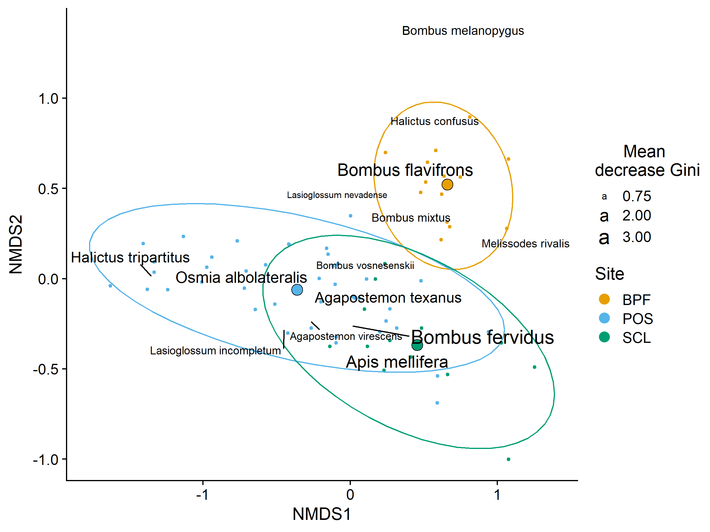
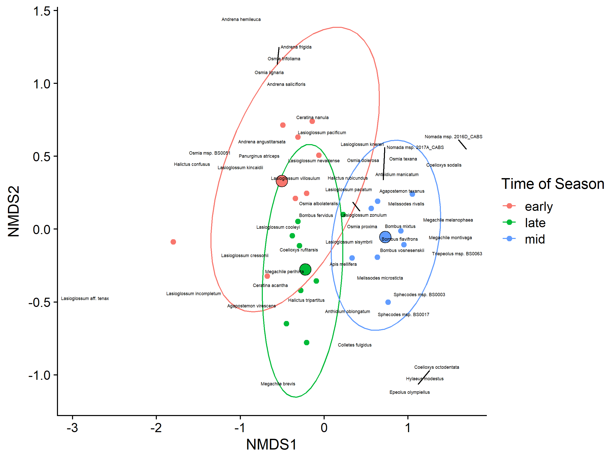

BeeSearch initial
================
Dr. Riley M. Anderson
July 23, 2024

  

- [Overview](#overview)
  - [Summary of Results](#summary-of-results)
- [How many species do we have at each location? How much variability is
  there in
  richness?](#how-many-species-do-we-have-at-each-location-how-much-variability-is-there-in-richness)
- [Sex ratio in trap vs. netting collection
  method:](#sex-ratio-in-trap-vs-netting-collection-method)
- [Chao indices](#chao-indices)
- [Does community composition change over
  time?](#does-community-composition-change-over-time)
- [How does community composition change across
  seasons?](#how-does-community-composition-change-across-seasons)
- [What bee groups drive changes in abundance from early to mid to late
  year?](#what-bee-groups-drive-changes-in-abundance-from-early-to-mid-to-late-year)
- [How does community composition change over
  time?](#how-does-community-composition-change-over-time)
- [All sites NMDS](#all-sites-nmds)
  - [NMDS by Site](#nmds-by-site)
    - [Site classification by species composition (Random
      Forest)](#site-classification-by-species-composition-random-forest)
- [POS 2017 Changes over seasons](#pos-2017-changes-over-seasons)
- [Can we do analysis with and without major species (H. tripartitus; A.
  texanus; M.
  microsticta/us)](#can-we-do-analysis-with-and-without-major-species-h-tripartitus-a-texanus-m-microstictaus)
- [What is the turnover of species within sub-sites within
  years?](#what-is-the-turnover-of-species-within-sub-sites-within-years)
  - [POS](#pos)
  - [SCL](#scl)
  - [BPF](#bpf)
- [Is there greater overall diversity at SCL vs POS vs
  PBF?](#is-there-greater-overall-diversity-at-scl-vs-pos-vs-pbf)
  - [Session Information](#session-information)

## Overview

What is this analysis about?

### Summary of Results

- 

# How many species do we have at each location? How much variability is there in richness?

<!-- --> This is purely species
counts, no kind of offset for sampling effort (other than excluding 2014
and 2020).

# Sex ratio in trap vs. netting collection method:

- Ratios \> 1 represent male bias

- Ratios \< 1 represent female bias

- Overall:

| Collection.Method | female | male | sex_ratio |
|:------------------|-------:|-----:|----------:|
| N                 |    682 |  402 |      0.59 |
| T                 |   5153 | 1255 |      0.24 |

- By site:

| Collection.Method | Site | female | male | sex_ratio |
|:------------------|:-----|-------:|-----:|----------:|
| N                 | BPF  |     61 |   92 |      1.51 |
| N                 | POS  |    570 |  255 |      0.45 |
| N                 | SCL  |     51 |   55 |      1.08 |
| T                 | BPF  |    751 |  278 |      0.37 |
| T                 | POS  |   3625 |  712 |      0.20 |
| T                 | SCL  |    777 |  265 |      0.34 |

- By season:

| Collection.Method | ToY   | female | male | sex_ratio |
|:------------------|:------|-------:|-----:|----------:|
| N                 | early |    129 |   82 |      0.64 |
| N                 | late  |    192 |  195 |      1.02 |
| N                 | mid   |    361 |  125 |      0.35 |
| T                 | early |   1471 |  322 |      0.22 |
| T                 | late  |   1150 |  337 |      0.29 |
| T                 | mid   |   2532 |  596 |      0.24 |

- By season and site:

| Collection.Method | ToY   | Site | female | male | sex_ratio |
|:------------------|:------|:-----|-------:|-----:|----------:|
| N                 | early | BPF  |     15 |   59 |      3.93 |
| N                 | early | POS  |    114 |   23 |      0.20 |
| N                 | late  | BPF  |     28 |   22 |      0.79 |
| N                 | late  | POS  |    164 |  173 |      1.05 |
| N                 | mid   | BPF  |     18 |   11 |      0.61 |
| N                 | mid   | POS  |    292 |   59 |      0.20 |
| N                 | mid   | SCL  |     51 |   55 |      1.08 |
| T                 | early | BPF  |    147 |   33 |      0.22 |
| T                 | early | POS  |    998 |  148 |      0.15 |
| T                 | early | SCL  |    326 |  141 |      0.43 |
| T                 | late  | BPF  |    190 |  108 |      0.57 |
| T                 | late  | POS  |    825 |  199 |      0.24 |
| T                 | late  | SCL  |    135 |   30 |      0.22 |
| T                 | mid   | BPF  |    414 |  137 |      0.33 |
| T                 | mid   | POS  |   1802 |  365 |      0.20 |
| T                 | mid   | SCL  |    316 |   94 |      0.30 |

# Chao indices

From Anne Chao 1989:

Chao1 minimum species richness is defined non-parametrically as:

")

- Chao indices by site

|  chao1 | Site |
|-------:|:-----|
| 103.89 | BPF  |
| 135.44 | POS  |
| 115.12 | SCL  |

- Chao indices by site and season

|  chao1 | Site | Season |
|-------:|:-----|:-------|
|  50.07 | BPF  | early  |
|  88.00 | BPF  | late   |
|  92.80 | BPF  | mid    |
|  95.56 | POS  | early  |
|  84.00 | POS  | late   |
| 117.00 | POS  | mid    |
| 102.14 | SCL  | early  |
|  42.10 | SCL  | late   |
| 109.50 | SCL  | mid    |

- Chao indices by station

| chao1 | Station |
|------:|:--------|
| 39.75 | BPF1    |
| 68.67 | BPF2    |
| 34.33 | BPF3    |
| 95.00 | BPF4    |
| 57.00 | BPF5    |
| 50.90 | BPF6    |
| 40.56 | BPF7    |
| 31.67 | BPF8    |
| 80.89 | POS1    |
| 18.67 | POS10   |
| 37.50 | POS11   |
| 75.00 | POS12   |
| 36.17 | POS13   |
| 94.75 | POS2    |
| 55.00 | POS20   |
| 61.73 | POS21   |
| 51.12 | POS22   |
| 66.67 | POS23   |
| 49.17 | POS24   |
| 55.60 | POS25   |
| 73.06 | POS3    |
| 55.25 | POS4    |
| 87.50 | POS5    |
| 48.33 | POS6    |
| 33.33 | POS7    |
| 86.00 | POS8    |
| 59.12 | POS9    |
| 77.50 | SCL1    |
| 94.17 | SCL2    |
| 80.50 | SCL3    |
| 75.33 | SCL4    |
| 44.17 | SCL5    |

- Chao indices by station and year

|  chao1 | Station | Year |
|-------:|:--------|:-----|
|  53.25 | BPF1    | 2018 |
|  61.67 | BPF1    | 2019 |
|  45.00 | BPF2    | 2018 |
|  47.17 | BPF2    | 2019 |
|  32.00 | BPF3    | 2018 |
|  38.12 | BPF3    | 2019 |
|  27.75 | BPF4    | 2018 |
|  44.12 | BPF4    | 2019 |
|  32.10 | BPF5    | 2018 |
|  58.33 | BPF5    | 2019 |
|  24.08 | BPF6    | 2018 |
|  93.00 | BPF6    | 2019 |
|  40.56 | BPF7    | 2019 |
|  31.67 | BPF8    | 2019 |
|  18.67 | POS10   | 2017 |
|  37.50 | POS11   | 2017 |
|  33.67 | POS12   | 2017 |
|  63.17 | POS12   | 2019 |
|  36.17 | POS13   | 2018 |
|  40.00 | POS1    | 2015 |
|  48.12 | POS1    | 2016 |
|  55.07 | POS1    | 2019 |
|  55.00 | POS20   | 2018 |
|  61.73 | POS21   | 2019 |
|  51.12 | POS22   | 2018 |
|  66.67 | POS23   | 2018 |
|  49.17 | POS24   | 2018 |
|  55.60 | POS25   | 2019 |
|  46.08 | POS2    | 2015 |
|  86.17 | POS2    | 2016 |
|  39.25 | POS2    | 2019 |
|  45.67 | POS3    | 2015 |
|  48.90 | POS3    | 2016 |
|  55.50 | POS3    | 2018 |
|  51.00 | POS4    | 2016 |
|  42.56 | POS4    | 2018 |
|  72.25 | POS5    | 2017 |
|  55.00 | POS5    | 2019 |
|  56.25 | POS6    | 2017 |
|  40.40 | POS6    | 2019 |
|  33.33 | POS7    | 2017 |
|  45.00 | POS8    | 2017 |
|  68.00 | POS8    | 2019 |
|  63.00 | POS9    | 2017 |
|  47.12 | POS9    | 2018 |
|  59.90 | SCL1    | 2015 |
|  96.50 | SCL1    | 2016 |
|  66.17 | SCL2    | 2015 |
|  40.10 | SCL2    | 2016 |
|  64.00 | SCL3    | 2015 |
|  56.25 | SCL3    | 2016 |
| 231.00 | SCL4    | 2015 |
|  39.50 | SCL4    | 2016 |
|  44.17 | SCL5    | 2016 |

<!-- --> \*\*
Minimum species richness (Chao1) across time.\*\* Points are stations
(sub sites), lines are fit by linear regression, and the shaded regions
are 95% confidence intervals. The data exclude 2014 and 2020, and all
net caught records.

# Does community composition change over time?

# How does community composition change across seasons?

    ## Permutation test for adonis under reduced model
    ## Terms added sequentially (first to last)
    ## Permutation: free
    ## Number of permutations: 999
    ## 
    ## adonis2(formula = mat.seasons ~ ToY * Year, data = meta.seasons, method = "bray")
    ##          Df SumOfSqs      R2      F Pr(>F)  
    ## ToY       2   0.3651 0.01546 0.7270  0.782  
    ## Year      4   1.4458 0.06120 1.4393  0.064 .
    ## ToY:Year  8   2.2250 0.09418 1.1074  0.277  
    ## Residual 78  19.5887 0.82917                
    ## Total    92  23.6246 1.00000                
    ## ---
    ## Signif. codes:  0 '***' 0.001 '**' 0.01 '*' 0.05 '.' 0.1 ' ' 1
    ## 
    ## Permutation test for homogeneity of multivariate dispersions
    ## Permutation: free
    ## Number of permutations: 999
    ## 
    ## Response: Distances
    ##           Df  Sum Sq  Mean Sq      F N.Perm Pr(>F)
    ## Groups     4 0.04383 0.010957 0.7228    999  0.595
    ## Residuals 88 1.33411 0.015160
    ## Run 0 stress 0.1489251 
    ## Run 1 stress 0.168991 
    ## Run 2 stress 0.1737159 
    ## Run 3 stress 0.1733901 
    ## Run 4 stress 0.1556336 
    ## Run 5 stress 0.1739859 
    ## Run 6 stress 0.1733535 
    ## Run 7 stress 0.1488932 
    ## ... New best solution
    ## ... Procrustes: rmse 0.004159155  max resid 0.02896881 
    ## Run 8 stress 0.1557387 
    ## Run 9 stress 0.1738632 
    ## Run 10 stress 0.1557741 
    ## Run 11 stress 0.1734864 
    ## Run 12 stress 0.1489253 
    ## ... Procrustes: rmse 0.004160093  max resid 0.02878677 
    ## Run 13 stress 0.1488992 
    ## ... Procrustes: rmse 0.003809408  max resid 0.03315956 
    ## Run 14 stress 0.1685648 
    ## Run 15 stress 0.1489255 
    ## ... Procrustes: rmse 0.00417887  max resid 0.02871834 
    ## Run 16 stress 0.2044408 
    ## Run 17 stress 0.1489234 
    ## ... Procrustes: rmse 0.005710341  max resid 0.0335781 
    ## Run 18 stress 0.1557445 
    ## Run 19 stress 0.1488933 
    ## ... Procrustes: rmse 4.365978e-05  max resid 0.0001990057 
    ## ... Similar to previous best
    ## Run 20 stress 0.1489253 
    ## ... Procrustes: rmse 0.004179056  max resid 0.02886394 
    ## *** Best solution repeated 1 times
    ## [1] 0.1488932

# What bee groups drive changes in abundance from early to mid to late year?

<!-- -->

# How does community composition change over time?

<!-- -->

# All sites NMDS

- By Site/Year

<!-- -->

    ## Permutation test for adonis under reduced model
    ## Terms added sequentially (first to last)
    ## Permutation: free
    ## Number of permutations: 999
    ## 
    ## adonis2(formula = site_matrix ~ Site + Year, data = site_meta, method = "bray")
    ##          Df SumOfSqs      R2      F Pr(>F)    
    ## Site      2   0.8270 0.08587 2.5675  0.002 ** 
    ## Year      4   1.2345 0.12818 1.9163  0.001 ***
    ## Residual 47   7.5697 0.78595                  
    ## Total    53   9.6313 1.00000                  
    ## ---
    ## Signif. codes:  0 '***' 0.001 '**' 0.01 '*' 0.05 '.' 0.1 ' ' 1
    ## 
    ## Permutation test for homogeneity of multivariate dispersions
    ## Permutation: free
    ## Number of permutations: 999
    ## 
    ## Response: Distances
    ##           Df  Sum Sq   Mean Sq      F N.Perm Pr(>F)
    ## Groups     4 0.04477 0.0111926 2.0206    999  0.112
    ## Residuals 49 0.27142 0.0055391
    ## 
    ## Permutation test for homogeneity of multivariate dispersions
    ## Permutation: free
    ## Number of permutations: 999
    ## 
    ## Response: Distances
    ##           Df   Sum Sq   Mean Sq      F N.Perm Pr(>F)  
    ## Groups     2 0.036553 0.0182766 3.4629    999  0.049 *
    ## Residuals 51 0.269166 0.0052778                       
    ## ---
    ## Signif. codes:  0 '***' 0.001 '**' 0.01 '*' 0.05 '.' 0.1 ' ' 1
    ## Run 0 stress 0.14218 
    ## Run 1 stress 0.1441717 
    ## Run 2 stress 0.1465901 
    ## Run 3 stress 0.1425627 
    ## ... Procrustes: rmse 0.066246  max resid 0.2112341 
    ## Run 4 stress 0.1425629 
    ## ... Procrustes: rmse 0.06624254  max resid 0.2110582 
    ## Run 5 stress 0.1421807 
    ## ... Procrustes: rmse 0.0003197582  max resid 0.00155504 
    ## ... Similar to previous best
    ## Run 6 stress 0.1421799 
    ## ... New best solution
    ## ... Procrustes: rmse 0.0002325377  max resid 0.0009753437 
    ## ... Similar to previous best
    ## Run 7 stress 0.1444582 
    ## Run 8 stress 0.1421801 
    ## ... Procrustes: rmse 0.0003936077  max resid 0.001859247 
    ## ... Similar to previous best
    ## Run 9 stress 0.142585 
    ## ... Procrustes: rmse 0.06595712  max resid 0.2156525 
    ## Run 10 stress 0.1425105 
    ## ... Procrustes: rmse 0.01963016  max resid 0.0856492 
    ## Run 11 stress 0.142563 
    ## ... Procrustes: rmse 0.06614714  max resid 0.2128941 
    ## Run 12 stress 0.1421392 
    ## ... New best solution
    ## ... Procrustes: rmse 0.00707175  max resid 0.04055688 
    ## Run 13 stress 0.1425105 
    ## ... Procrustes: rmse 0.0165995  max resid 0.08089608 
    ## Run 14 stress 0.1443164 
    ## Run 15 stress 0.142352 
    ## ... Procrustes: rmse 0.008513743  max resid 0.05117452 
    ## Run 16 stress 0.14218 
    ## ... Procrustes: rmse 0.007219432  max resid 0.04136733 
    ## Run 17 stress 0.1421807 
    ## ... Procrustes: rmse 0.007503178  max resid 0.04305177 
    ## Run 18 stress 0.1421811 
    ## ... Procrustes: rmse 0.007616049  max resid 0.04374068 
    ## Run 19 stress 0.1425629 
    ## ... Procrustes: rmse 0.06471791  max resid 0.2095771 
    ## Run 20 stress 0.1421805 
    ## ... Procrustes: rmse 0.007438665  max resid 0.04281042 
    ## *** Best solution was not repeated -- monoMDS stopping criteria:
    ##      1: no. of iterations >= maxit
    ##     19: stress ratio > sratmax
    ## [1] 0.1421392

<!-- -->

## NMDS by Site

<!-- -->

### Site classification by species composition (Random Forest)

    ## Random Forest 
    ## 
    ##  54 samples
    ## 144 predictors
    ##   3 classes: 'BPF', 'POS', 'SCL' 
    ## 
    ## No pre-processing
    ## Resampling: Bootstrapped (25 reps) 
    ## Summary of sample sizes: 54, 54, 54, 54, 54, 54, ... 
    ## Resampling results across tuning parameters:
    ## 
    ##   mtry  Accuracy   Kappa    
    ##     2   0.7162212  0.4413013
    ##    73   0.7994397  0.6228369
    ##   144   0.7599393  0.5582317
    ## 
    ## Accuracy was used to select the optimal model using the largest value.
    ## The final value used for the model was mtry = 73.
    ## 
    ## Call:
    ##  randomForest(x = select(rf_matrix, -Year, -Station, -StationYear,      -Site), y = rf_matrix$Site, mtry = 73, importance = T, nPerm = 999) 
    ##                Type of random forest: classification
    ##                      Number of trees: 500
    ## No. of variables tried at each split: 73
    ## 
    ##         OOB estimate of  error rate: 18.52%
    ## Confusion matrix:
    ##     BPF POS SCL class.error
    ## BPF  13   1   0  0.07142857
    ## POS   0  31   0  0.00000000
    ## SCL   2   7   0  1.00000000

<!-- -->

|                          |    BPF |    POS |    SCL | MeanDecreaseAccuracy | MeanDecreaseGini |
|:-------------------------|-------:|-------:|-------:|---------------------:|-----------------:|
| Agapostemon texanus      | 11.014 |  9.309 | -1.762 |               11.219 |            2.943 |
| Halictus tripartitus     |  7.448 | 10.464 |  1.818 |               11.058 |            2.521 |
| Osmia albolateralis      |  7.684 |  7.447 |  1.896 |                8.830 |            1.970 |
| Bombus fervidus          |  9.181 |  4.041 |  3.098 |                8.548 |            1.836 |
| Apis mellifera           |  7.789 |  5.013 |  0.863 |                8.151 |            1.387 |
| Bombus melanopygus       |  6.869 |  3.577 |  3.142 |                6.800 |            1.185 |
| Bombus flavifrons        |  2.884 |  1.185 |  5.454 |                5.156 |            1.111 |
| Halictus confusus        |  5.884 |  2.035 |  0.226 |                5.715 |            0.791 |
| Lasioglossum incompletum |  5.165 |  1.485 | -0.400 |                4.579 |            0.781 |
| Megachile melanophaea    |  5.617 |  4.072 |  1.306 |                5.766 |            0.775 |
| Bombus vosnesenskii      |  3.045 |  1.447 |  1.214 |                3.072 |            0.688 |
| Andrena hemileuca        |  2.606 |  0.015 |  3.304 |                2.803 |            0.643 |
| Melissodes microsticta   |  0.513 |  0.266 | -0.404 |                0.546 |            0.575 |
| Ceratina acantha         |  3.609 |  1.951 | -2.707 |                3.380 |            0.548 |
| Melissodes rivalis       |  3.101 |  3.943 |  0.687 |                4.773 |            0.519 |

\*\* Random Forest classification of site by species composition.\*\*
The model was tuned without pre-processing. Bootstrapped resampling used
25 replicates. Overall model accuracy was 76.4%. The model clearly
delineated the BPF sites with 0.00 class error. Similarly, POS sites
were near perfect with 0.029 class error. However, the SCL sites were
never classified correctly (1.00 class error), with most (8/9)
identified as POS. This lends further support to the NMDS figure above,
species composition is very similar across SCL and POS, but BPF sites
have different community composition compared to the other two sites.

The table above shows the species most representative of the community
differences used to make the above classifications. These species are
the top 10th percentile of ranked variable importance (mean decrease in
Gini score). Take this with a grain of salt, the model didn’t do a great
job, overall Out of Bag error rate = 19.3%. This is almost unacceptable,
especially because Random Forest more often overfits the data.

- By year <!-- -->

# POS 2017 Changes over seasons

    ## Permutation test for adonis under reduced model
    ## Terms added sequentially (first to last)
    ## Permutation: free
    ## Number of permutations: 999
    ## 
    ## adonis2(formula = nmds2017dist ~ meta2017$ToY, method = "bray")
    ##              Df SumOfSqs      R2      F Pr(>F)  
    ## meta2017$ToY  2   0.7965 0.12704 1.5281  0.027 *
    ## Residual     21   5.4731 0.87296                
    ## Total        23   6.2696 1.00000                
    ## ---
    ## Signif. codes:  0 '***' 0.001 '**' 0.01 '*' 0.05 '.' 0.1 ' ' 1
    ## 
    ## Permutation test for homogeneity of multivariate dispersions
    ## Permutation: free
    ## Number of permutations: 999
    ## 
    ## Response: Distances
    ##           Df   Sum Sq   Mean Sq    F N.Perm Pr(>F)  
    ## Groups     2 0.014532 0.0072659 3.86    999  0.028 *
    ## Residuals 21 0.039529 0.0018823                     
    ## ---
    ## Signif. codes:  0 '***' 0.001 '**' 0.01 '*' 0.05 '.' 0.1 ' ' 1

Within the Port of Seattle sites in 2017 and only 2017, species
composition changes significantly throughout the season with distinct
groups of species in early, mid, and late season sampling.

<!-- -->
**Non-metric multidimensional scaling of bee species in Port of Seattle
in 2017.** Points are sub-sites within the port of Seattle in 2017. They
are separated by time of season with the 8 sub sites at the early season
in red, the same 8 sub sites at the middle season in blue, and the same
8 sub sites at the end of the season in green. The NMDS space represents
total bee species composition and the labels are specific bee species
and their position in NMDS space. Large points are the centroids (means)
of the points in NMDS space. Ellipses are 95% confidence intervals
around the centroids.

# Can we do analysis with and without major species (H. tripartitus; A. texanus; M. microsticta/us)

What analysis?

# What is the turnover of species within sub-sites within years?

### POS

<!-- -->

### SCL

<!-- -->

### BPF

<!-- -->

# Is there greater overall diversity at SCL vs POS vs PBF?

| Site | Shannon | Simpson | InvSimpson | UnbiasedSimpson | FisherAlpha |
|:-----|--------:|--------:|-----------:|----------------:|------------:|
| POS  |    3.57 |    0.95 |      22.14 |            0.95 |       26.49 |
| BPF  |    3.51 |    0.96 |      22.35 |            0.96 |       19.71 |
| SCL  |    3.48 |    0.95 |      20.40 |            0.95 |       23.05 |

Diversity is similar across all 3 sites.

## Session Information

    R version 4.2.3 (2023-03-15 ucrt)
    Platform: x86_64-w64-mingw32/x64 (64-bit)
    Running under: Windows 10 x64 (build 19045)

    Matrix products: default

    locale:
    [1] LC_COLLATE=English_United States.utf8 
    [2] LC_CTYPE=English_United States.utf8   
    [3] LC_MONETARY=English_United States.utf8
    [4] LC_NUMERIC=C                          
    [5] LC_TIME=English_United States.utf8    

    attached base packages:
    [1] stats     graphics  grDevices utils     datasets  methods   base     

    other attached packages:
     [1] caret_6.0-94         randomForest_4.7-1.1 geosphere_1.5-18    
     [4] fossil_0.4.0         shapefiles_0.7.2     foreign_0.8-84      
     [7] maps_3.4.2           sp_2.1-4             knitr_1.47          
    [10] adespatial_0.3-23    vegan_2.6-6.1        lattice_0.20-45     
    [13] permute_0.9-7        cowplot_1.1.3        lubridate_1.9.3     
    [16] forcats_1.0.0        stringr_1.5.1        dplyr_1.1.4         
    [19] purrr_1.0.2          readr_2.1.5          tidyr_1.3.1         
    [22] tibble_3.2.1         ggplot2_3.5.1        tidyverse_2.0.0     

    loaded via a namespace (and not attached):
      [1] colorspace_2.1-0     seqinr_4.2-36        deldir_2.0-4        
      [4] class_7.3-21         rprojroot_2.0.4      rstudioapi_0.16.0   
      [7] proxy_0.4-27         farver_2.1.2         listenv_0.9.1       
     [10] ggrepel_0.9.5        prodlim_2023.08.28   fansi_1.0.6         
     [13] xml2_1.3.6           codetools_0.2-19     splines_4.2.3       
     [16] ade4_1.7-22          pROC_1.18.5          phylobase_0.8.12    
     [19] cluster_2.1.4        png_0.1-8            shiny_1.8.1.1       
     [22] compiler_4.2.3       httr_1.4.7           adegraphics_1.0-21  
     [25] Matrix_1.5-3         fastmap_1.2.0        cli_3.6.1           
     [28] later_1.3.2          s2_1.1.6             htmltools_0.5.8.1   
     [31] prettyunits_1.2.0    tools_4.2.3          igraph_2.0.3        
     [34] gtable_0.3.5         glue_1.7.0           reshape2_1.4.4      
     [37] wk_0.9.1             Rcpp_1.0.12          vctrs_0.6.5         
     [40] spdep_1.3-5          ape_5.8              nlme_3.1-162        
     [43] iterators_1.0.14     timeDate_4032.109    gower_1.0.1         
     [46] xfun_0.44            globals_0.16.3       adephylo_1.1-16     
     [49] timechange_0.3.0     mime_0.12            lifecycle_1.0.4     
     [52] XML_3.99-0.16.1      future_1.33.2        MASS_7.3-58.2       
     [55] scales_1.3.0         ipred_0.9-14         hms_1.1.3           
     [58] promises_1.3.0       parallel_4.2.3       RColorBrewer_1.1-3  
     [61] yaml_2.3.8           rpart_4.1.23         latticeExtra_0.6-30 
     [64] stringi_1.8.4        highr_0.11           foreach_1.5.2       
     [67] e1071_1.7-14         hardhat_1.4.0        boot_1.3-28.1       
     [70] lava_1.8.0           spData_2.3.1         rlang_1.1.4         
     [73] pkgconfig_2.0.3      rncl_0.8.7           evaluate_0.24.0     
     [76] sf_1.0-16            labeling_0.4.3       recipes_1.0.10      
     [79] tidyselect_1.2.1     parallelly_1.37.1    plyr_1.8.9          
     [82] magrittr_2.0.3       R6_2.5.1             generics_0.1.3      
     [85] DBI_1.2.3            pillar_1.9.0         withr_3.0.0         
     [88] mgcv_1.8-42          units_0.8-5          nnet_7.3-18         
     [91] survival_3.5-3       future.apply_1.11.2  crayon_1.5.2        
     [94] uuid_1.2-0           interp_1.1-6         KernSmooth_2.23-20  
     [97] utf8_1.2.4           tzdb_0.4.0           rmarkdown_2.27      
    [100] jpeg_0.1-10          progress_1.2.3       RNeXML_2.4.11       
    [103] adegenet_2.1.10      grid_4.2.3           data.table_1.15.4   
    [106] ModelMetrics_1.2.2.2 digest_0.6.35        classInt_0.4-10     
    [109] xtable_1.8-4         httpuv_1.6.15        stats4_4.2.3        
    [112] munsell_0.5.1       
