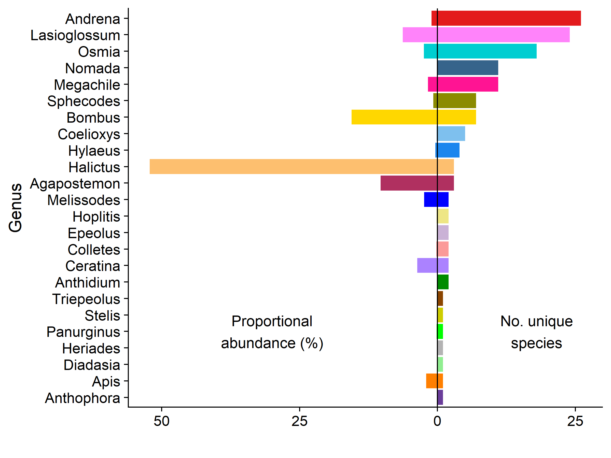
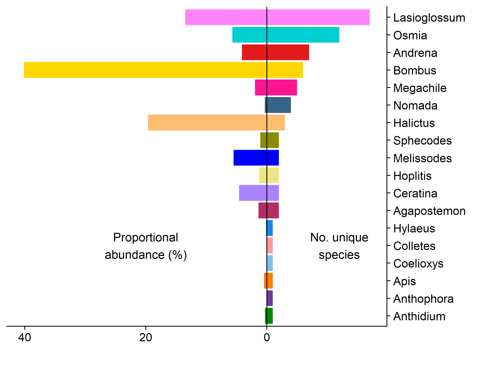
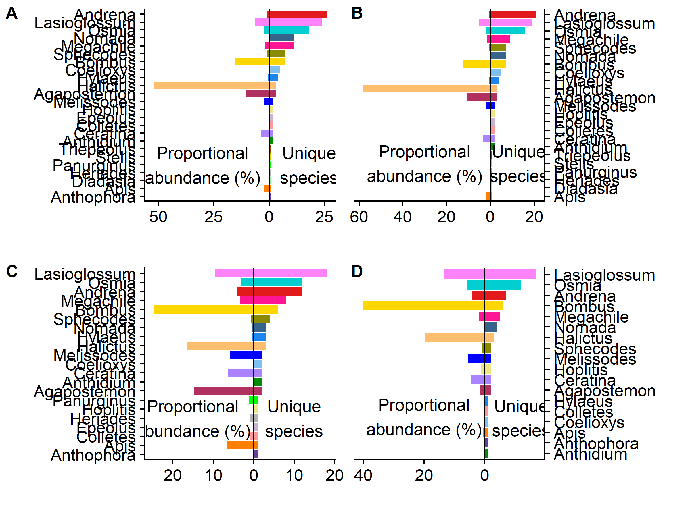
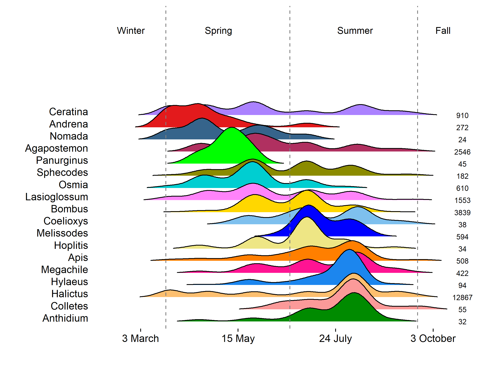
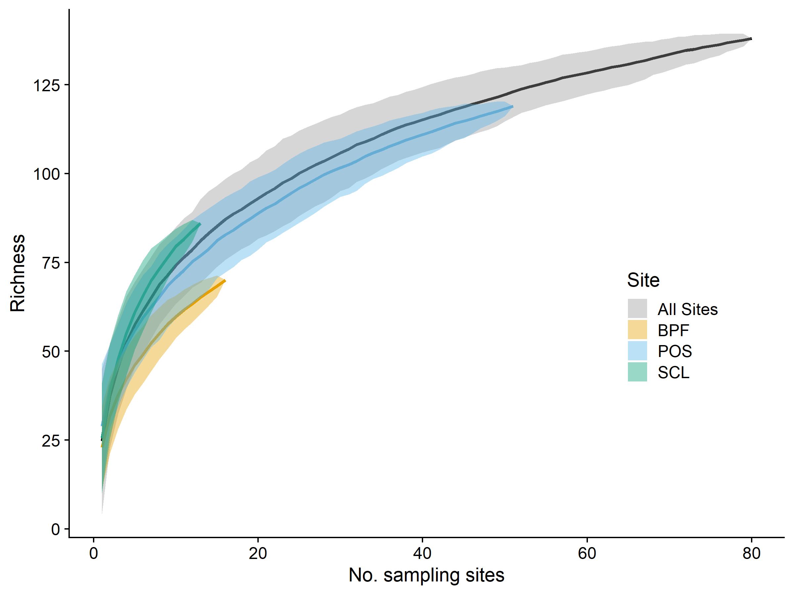
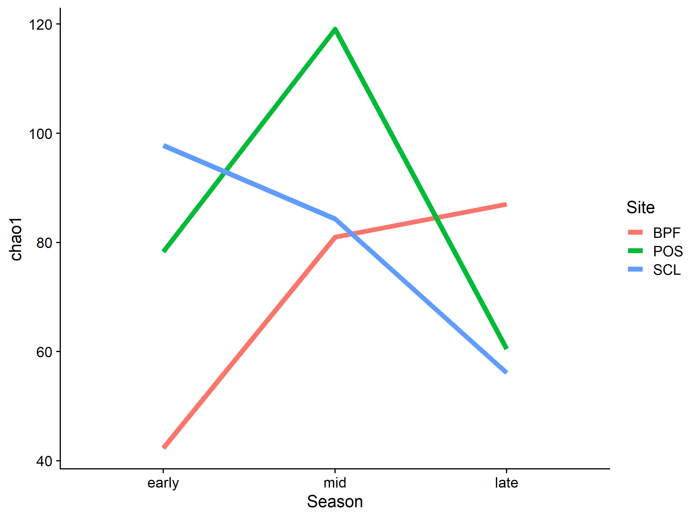
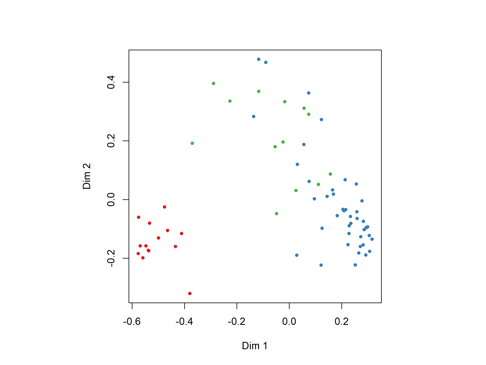

BeeSearch initial
================
Dr. Riley M. Anderson
October 25, 2024

  

- [Overview](#overview)
  - [Summary of Results](#summary-of-results)
- [Descriptive measures of genera](#descriptive-measures-of-genera)
  - [All sites together](#all-sites-together)
  - [POS](#pos)
  - [SCL](#scl)
  - [BPF](#bpf)
  - [All genus plots together in one
    figure:](#all-genus-plots-together-in-one-figure)
- [Genus by time of year](#genus-by-time-of-year)
- [Species by time of year](#species-by-time-of-year)
- [Genera with multiple species by time of
  year](#genera-with-multiple-species-by-time-of-year)
- [How many species do we have at each location? How much variability is
  there in
  richness?](#how-many-species-do-we-have-at-each-location-how-much-variability-is-there-in-richness)
- [Sex ratio in trap vs. netting collection
  method:](#sex-ratio-in-trap-vs-netting-collection-method)
- [Species accumulation curves](#species-accumulation-curves)
- [Chao indices](#chao-indices)
- [Does community composition change across seasons, sites, or
  years?](#does-community-composition-change-across-seasons-sites-or-years)
  - [Across seasons: (I don’t think we should include
    this)](#across-seasons-i-dont-think-we-should-include-this)
  - [Across sites](#across-sites)
    - [Site classification by species composition (Random
      Forest)](#site-classification-by-species-composition-random-forest)
    - [NMDS by Site figure (include
      this)](#nmds-by-site-figure-include-this)
  - [Across years (I don’t think we should include
    this)](#across-years-i-dont-think-we-should-include-this)
- [POS 2017 Changes over seasons (This is not
  interesting)](#pos-2017-changes-over-seasons-this-is-not-interesting)
- [What is the turnover of species within sub-sites within
  years?](#what-is-the-turnover-of-species-within-sub-sites-within-years)
  - [POS](#pos-1)
  - [SCL](#scl-1)
  - [BPF](#bpf-1)
- [Is there greater overall diversity at SCL vs POS vs
  PBF?](#is-there-greater-overall-diversity-at-scl-vs-pos-vs-pbf)
  - [Session Information](#session-information)

## Overview

What is this analysis about?

### Summary of Results

- 

# Descriptive measures of genera

## All sites together

<!-- -->

## POS

<!-- -->

## SCL

<!-- -->

## BPF

<!-- -->

## All genus plots together in one figure:

<!-- -->

# Genus by time of year

<!-- -->

# Species by time of year

<!-- -->

# Genera with multiple species by time of year

<!-- -->

# How many species do we have at each location? How much variability is there in richness?

<!-- --> Raw species counts
(excluding incompatible year/stations with altered sampling efforts).
Males and females are included. Collection method includes both trap and
net.

# Sex ratio in trap vs. netting collection method:

- Ratios \> 1 represent male bias

- Ratios \< 1 represent female bias

- Overall:

| Collection.Method | Male | female | male | sex_ratio |
|:------------------|-----:|-------:|-----:|----------:|
| T                 |    2 |  19330 | 1542 |      0.08 |
| N                 |    0 |   1659 |  406 |      0.24 |

- By site:

| Collection.Method | Site | Male | female | male | sex_ratio |
|:------------------|:-----|-----:|-------:|-----:|----------:|
| T                 | SCL  |    2 |   1465 |  314 |      0.21 |
| N                 | BPF  |    0 |     69 |   94 |      1.36 |
| N                 | POS  |    0 |   1538 |  255 |      0.17 |
| N                 | SCL  |    0 |     52 |   57 |      1.10 |
| T                 | BPF  |    0 |   1332 |  349 |      0.26 |
| T                 | POS  |    0 |  16533 |  879 |      0.05 |

<!-- --> **Sex
ratios of bees by site and collection method.** Points above the dashed
line represent male bias, whereas point below represent female bias.

- By season:

| Collection.Method | ToY   | Male | female | male | sex_ratio |
|:------------------|:------|-----:|-------:|-----:|----------:|
| T                 | mid   |    2 |   7221 |  721 |      0.10 |
| N                 | early |    0 |    128 |   81 |      0.63 |
| N                 | late  |    0 |   1084 |  201 |      0.19 |
| N                 | mid   |    0 |    447 |  124 |      0.28 |
| T                 | early |    0 |   4473 |  380 |      0.08 |
| T                 | late  |    0 |   7636 |  441 |      0.06 |

- By season and site:

| Collection.Method | ToY   | Site | Male | female | male | sex_ratio |
|:------------------|:------|:-----|-----:|-------:|-----:|----------:|
| T                 | mid   | SCL  |    2 |    713 |  125 |      0.18 |
| N                 | early | BPF  |    0 |     15 |   59 |      3.93 |
| N                 | early | POS  |    0 |    113 |   22 |      0.19 |
| N                 | late  | BPF  |    0 |     36 |   24 |      0.67 |
| N                 | late  | POS  |    0 |   1048 |  175 |      0.17 |
| N                 | mid   | BPF  |    0 |     18 |   11 |      0.61 |
| N                 | mid   | POS  |    0 |    377 |   58 |      0.15 |
| N                 | mid   | SCL  |    0 |     52 |   55 |      1.06 |
| T                 | early | BPF  |    0 |    203 |   47 |      0.23 |
| T                 | early | POS  |    0 |   3815 |  193 |      0.05 |
| T                 | early | SCL  |    0 |    455 |  140 |      0.31 |
| T                 | late  | BPF  |    0 |    346 |  138 |      0.40 |
| T                 | late  | POS  |    0 |   6993 |  254 |      0.04 |
| T                 | late  | SCL  |    0 |    297 |   49 |      0.16 |
| T                 | mid   | BPF  |    0 |    783 |  164 |      0.21 |
| T                 | mid   | POS  |    0 |   5725 |  432 |      0.08 |
| N                 | late  | SCL  |    0 |      0 |    2 |       Inf |

<!-- -->
**Sex ratios of bees collected by either net or trap across the sampling
season.** Points above the dashed line represent male bias, whereas
point below represent female bias. Early season (late March - mid May),
mid season (mid May to mid July), and late season (mid July - late
September) time windows in the sampling effort are shown. Large solid
points are sex ratios calculated at the season level. Small open points
are sex ratios calculated at the sub-site level within each season.
Small points are spread horizontally for visual clarity.

# Species accumulation curves

- Trap caught only (no net records)

<!-- -->

- Trap and net caught records

<!-- -->

# Chao indices

From Anne Chao 1989:

Chao1 minimum species richness is defined non-parametrically as:

")

- Chao indices by site

|  chao1 | Site |
|-------:|:-----|
|  92.79 | BPF  |
| 108.46 | POS  |
| 104.35 | SCL  |

- Chao indices by site and season

|  chao1 | Site | Season |
|-------:|:-----|:-------|
|  42.33 | BPF  | early  |
|  87.00 | BPF  | late   |
|  81.00 | BPF  | mid    |
|  78.29 | POS  | early  |
| 105.50 | POS  | late   |
|  89.00 | POS  | mid    |
|  97.79 | SCL  | early  |
|  56.12 | SCL  | late   |
|  84.33 | SCL  | mid    |

<!-- -->

**Overall Chao1 minimum species richness across the sampling season.**
Estimated species richness in early (late March - mid May), mid (mid May
to mid July), and late (mid July - late September) time windows in the
sampling effort. Richness across sites converge in the mid-summer.

- Chao indices by station

| chao1 | Station |
|------:|:--------|
| 38.40 | BPF1    |
| 62.17 | BPF2    |
| 32.90 | BPF3    |
| 79.00 | BPF4    |
| 49.00 | BPF5    |
| 43.10 | BPF6    |
| 41.07 | BPF7    |
| 44.50 | BPF8    |
| 78.57 | POS1    |
| 18.67 | POS10   |
| 33.10 | POS11   |
| 53.12 | POS12   |
| 36.17 | POS13   |
| 96.00 | POS2    |
| 50.90 | POS20   |
| 50.45 | POS21   |
| 51.12 | POS22   |
| 61.25 | POS23   |
| 53.00 | POS24   |
| 49.40 | POS25   |
| 73.14 | POS3    |
| 50.29 | POS4    |
| 77.00 | POS5    |
| 41.90 | POS6    |
| 35.00 | POS7    |
| 75.40 | POS8    |
| 51.12 | POS9    |
| 87.79 | SCL1    |
| 84.12 | SCL2    |
| 58.12 | SCL3    |
| 74.56 | SCL4    |
| 32.67 | SCL5    |

- Chao indices by station and year

|  chao1 | Station | Year |
|-------:|:--------|:-----|
|  73.00 | BPF1    | 2018 |
|  56.17 | BPF1    | 2019 |
|  46.17 | BPF2    | 2018 |
|  41.67 | BPF2    | 2019 |
|  32.12 | BPF3    | 2018 |
|  34.50 | BPF3    | 2019 |
|  24.90 | BPF4    | 2018 |
|  44.12 | BPF4    | 2019 |
|  32.12 | BPF5    | 2018 |
|  48.90 | BPF5    | 2019 |
|  25.12 | BPF6    | 2018 |
|  62.00 | BPF6    | 2019 |
|  41.07 | BPF7    | 2019 |
|  44.50 | BPF8    | 2019 |
|  18.67 | POS10   | 2017 |
|  33.10 | POS11   | 2017 |
|  34.25 | POS12   | 2017 |
|  39.00 | POS12   | 2019 |
|  36.17 | POS13   | 2018 |
|  40.00 | POS1    | 2015 |
|  44.00 | POS1    | 2016 |
|  64.17 | POS1    | 2019 |
|  50.90 | POS20   | 2018 |
|  50.45 | POS21   | 2019 |
|  51.12 | POS22   | 2018 |
|  61.25 | POS23   | 2018 |
|  53.00 | POS24   | 2018 |
|  49.40 | POS25   | 2019 |
|  46.08 | POS2    | 2015 |
|  86.17 | POS2    | 2016 |
|  41.12 | POS2    | 2019 |
|  45.67 | POS3    | 2015 |
|  45.40 | POS3    | 2016 |
|  52.00 | POS3    | 2018 |
|  45.25 | POS4    | 2016 |
|  40.14 | POS4    | 2018 |
|  72.25 | POS5    | 2017 |
|  56.60 | POS5    | 2019 |
|  41.00 | POS6    | 2017 |
|  35.60 | POS6    | 2019 |
|  35.00 | POS7    | 2017 |
|  41.12 | POS8    | 2017 |
|  58.50 | POS8    | 2019 |
|  86.50 | POS9    | 2017 |
|  43.50 | POS9    | 2018 |
|  48.00 | SCL1    | 2014 |
|  59.90 | SCL1    | 2015 |
| 116.67 | SCL1    | 2016 |
|  38.25 | SCL2    | 2014 |
|  61.00 | SCL2    | 2015 |
|  43.12 | SCL2    | 2016 |
|  13.00 | SCL3    | 2014 |
|  51.00 | SCL3    | 2015 |
|  75.00 | SCL3    | 2016 |
|  22.90 | SCL4    | 2014 |
| 111.00 | SCL4    | 2015 |
|  39.50 | SCL4    | 2016 |
|  32.67 | SCL5    | 2016 |

<!-- -->

**Species richness across sites and sampling years** Points are mean
Chao1 estimated species richness, triangles are raw species counts at
each substation within each site. Chao richness estimates are lifted by
an additive parameter that accounts for rare species likely missed in
the sampling. The data exclude some morphospecies (see methods), and all
net caught records.

# Does community composition change across seasons, sites, or years?

## Across seasons: (I don’t think we should include this)

<!-- -->
**Community composition across time of season.** Strong overlap of
composition across the early, mid, and late season sampling (PERMANOVA:
F = 0.71, 0.8). Data include all compatible stations across all years.

## Across sites

    ## Permutation test for adonis under reduced model
    ## Terms added sequentially (first to last)
    ## Permutation: free
    ## Number of permutations: 999
    ## 
    ## adonis2(formula = site_matrix ~ Site * Year, data = site_meta, method = "bray")
    ##           Df SumOfSqs      R2      F Pr(>F)    
    ## Site       2   0.8299 0.06331 2.2719  0.013 *  
    ## Year       5   2.9453 0.22470 3.2253  0.001 ***
    ## Site:Year  2   0.5657 0.04316 1.5486  0.092 .  
    ## Residual  48   8.7667 0.66883                  
    ## Total     57  13.1076 1.00000                  
    ## ---
    ## Signif. codes:  0 '***' 0.001 '**' 0.01 '*' 0.05 '.' 0.1 ' ' 1
    ## 
    ## Permutation test for homogeneity of multivariate dispersions
    ## Permutation: free
    ## Number of permutations: 999
    ## 
    ## Response: Distances
    ##           Df  Sum Sq  Mean Sq      F N.Perm Pr(>F)   
    ## Groups     5 0.25002 0.050004 3.4661    999  0.007 **
    ## Residuals 52 0.75018 0.014427                        
    ## ---
    ## Signif. codes:  0 '***' 0.001 '**' 0.01 '*' 0.05 '.' 0.1 ' ' 1
    ## 
    ## Permutation test for homogeneity of multivariate dispersions
    ## Permutation: free
    ## Number of permutations: 999
    ## 
    ## Response: Distances
    ##           Df  Sum Sq   Mean Sq      F N.Perm Pr(>F)
    ## Groups     2 0.01095 0.0054731 0.4431    999  0.647
    ## Residuals 55 0.67935 0.0123518

### Site classification by species composition (Random Forest)

    ## Random Forest 
    ## 
    ##  58 samples
    ## 135 predictors
    ##   3 classes: 'BPF', 'POS', 'SCL' 
    ## 
    ## No pre-processing
    ## Resampling: Bootstrapped (25 reps) 
    ## Summary of sample sizes: 58, 58, 58, 58, 58, 58, ... 
    ## Resampling results across tuning parameters:
    ## 
    ##   mtry  Accuracy   Kappa    
    ##     2   0.7361485  0.4947978
    ##    68   0.8549307  0.7455251
    ##   135   0.8129852  0.6782722
    ## 
    ## Accuracy was used to select the optimal model using the largest value.
    ## The final value used for the model was mtry = 68.
    ## 
    ## Call:
    ##  randomForest(x = select(rf_matrix, -Year, -Station, -StationYear,      -Site), y = rf_matrix$Site, mtry = 68, importance = T, nPerm = 999,      proximity = T) 
    ##                Type of random forest: classification
    ##                      Number of trees: 500
    ## No. of variables tried at each split: 68
    ## 
    ##         OOB estimate of  error rate: 8.62%
    ## Confusion matrix:
    ##     BPF POS SCL class.error
    ## BPF  14   0   0   0.0000000
    ## POS   0  31   0   0.0000000
    ## SCL   1   4   8   0.3846154

|                          |    BPF |    POS |    SCL | MeanDecreaseAccuracy | MeanDecreaseGini |
|:-------------------------|-------:|-------:|-------:|---------------------:|-----------------:|
| Halictus tripartitus     |  7.438 | 10.981 |  4.746 |               11.922 |            3.064 |
| Agapostemon texanus      | 10.542 |  9.875 | -0.238 |               10.970 |            2.973 |
| Bombus flavifrons        |  5.807 |  3.277 |  9.846 |                9.770 |            2.092 |
| Apis mellifera           |  9.637 |  5.771 |  4.844 |                9.699 |            2.021 |
| Osmia albolateralis      |  5.788 |  7.344 |  4.567 |                8.566 |            2.011 |
| Bombus fervidus          |  8.918 |  5.311 |  0.558 |                8.414 |            1.825 |
| Bombus melanopygus       |  7.588 |  2.751 |  3.354 |                7.444 |            1.192 |
| Melissodes rivalis       |  1.410 |  2.521 | -1.338 |                2.556 |            0.877 |
| Megachile melanophaea    |  3.913 |  4.211 |  2.409 |                5.375 |            0.868 |
| Bombus vosnesenskii      |  3.729 |  3.692 | -0.610 |                3.882 |            0.832 |
| Halictus confusus        |  6.360 |  1.236 |  3.850 |                6.363 |            0.832 |
| Lasioglossum incompletum |  5.181 |  0.627 | -1.700 |                2.827 |            0.675 |
| Lasioglossum nevadense   |  1.372 |  1.065 |  3.519 |                3.212 |            0.661 |
| Melissodes microsticta   |  1.313 |  0.519 |  0.073 |                1.060 |            0.657 |

<!-- -->

**Random Forest classification of site by species composition.** The
model was tuned without pre-processing. Bootstrapped resampling used 25
replicates. Overall model accuracy was 82%. The model clearly delineated
the BPF sites with 0.0 class error. Similarly, POS sites were near
perfect with 0.032 class error. However, the SCL sites were less
accurately classified (0.385 class error), with (5/13) identified as
POS. This lends further support to the NMDS figure below, species
composition is very similar across SCL and POS, but BPF sites have
different community composition compared to the other two sites.

The table above shows the species most representative of the community
differences used to make the above classifications. These species are
the top 10th percentile of ranked variable importance (mean decrease in
Gini score).

### NMDS by Site figure (include this)

<!-- -->
**Variation in community composition across sites.** Bee species are
plotted on the first two axes of a three-dimensional non-metric
multidimensional scaling ordination of the 58 combinations of station
(subsite) and year, across the three sites. Small points are the
individual station/year combinations. Large points are the centroids of
the three sites. Ellipses are 95% confidence intervals around the site
centroids. Bees species shown are the most representative (top 10th
percentile of a random forest analysis) of the compositional differences
among sites. Text size of the labels is proportional to variable
importance score (mean decrease in Gini score).

## Across years (I don’t think we should include this)

<!-- --> **Community
composition across years.** Most years have strong overlap of
composition but the *year* term is highly significant (PERMANOVA: F =
3.23, *P* = 0.001). However, the only site in 2014 is SCL and the 2018
and 2019 years are heavily influenced by the BPF data. Essentially, the
information in *years* is not sufficiently distinct from the information
in *sites* and including *year* in the model is not informative. This is
also the likely cause of the violation of homogeneity of multivariate
dispersions for the *year* term but not the *site* term.

# POS 2017 Changes over seasons (This is not interesting)

    ## Permutation test for adonis under reduced model
    ## Terms added sequentially (first to last)
    ## Permutation: free
    ## Number of permutations: 999
    ## 
    ## adonis2(formula = nmds2017dist ~ meta2017$ToY, method = "bray")
    ##              Df SumOfSqs      R2      F Pr(>F)  
    ## meta2017$ToY  2   0.7260 0.11645 1.3839  0.057 .
    ## Residual     21   5.5083 0.88355                
    ## Total        23   6.2343 1.00000                
    ## ---
    ## Signif. codes:  0 '***' 0.001 '**' 0.01 '*' 0.05 '.' 0.1 ' ' 1
    ## 
    ## Permutation test for homogeneity of multivariate dispersions
    ## Permutation: free
    ## Number of permutations: 999
    ## 
    ## Response: Distances
    ##           Df   Sum Sq   Mean Sq     F N.Perm Pr(>F)  
    ## Groups     2 0.013242 0.0066209 2.896    999  0.083 .
    ## Residuals 21 0.048010 0.0022862                      
    ## ---
    ## Signif. codes:  0 '***' 0.001 '**' 0.01 '*' 0.05 '.' 0.1 ' ' 1

Within the Port of Seattle sites in 2017 and only 2017, species
composition changes significantly throughout the season with distinct
groups of species in early, mid, and late season sampling. **However,
this model violates homogeneity of multivariate dispersions.**

<!-- -->
**Non-metric multidimensional scaling of bee species in Port of Seattle
in 2017.** Points are sub-sites within the port of Seattle in 2017. They
are separated by time of season with the 8 sub sites at the early season
in red, the same 8 sub sites at the middle season in blue, and the same
8 sub sites at the end of the season in green. The NMDS space represents
total bee species composition and the labels are specific bee species
and their position in NMDS space. Large points are the centroids (means)
of the points in NMDS space. Ellipses are 95% confidence intervals
around the centroids.

# What is the turnover of species within sub-sites within years?

### POS

<!-- -->

### SCL

<!-- -->

### BPF

<!-- -->

# Is there greater overall diversity at SCL vs POS vs PBF?

| Site | Shannon | Simpson | InvSimpson | UnbiasedSimpson | FisherAlpha |
|:-----|--------:|--------:|-----------:|----------------:|------------:|
| POS  |    2.11 |    0.69 |       3.26 |            0.69 |       20.87 |
| BPF  |    3.17 |    0.93 |      14.47 |            0.93 |       17.29 |
| SCL  |    3.12 |    0.92 |      12.27 |            0.92 |       20.49 |

Diversity is similar across all 3 sites.

## Session Information

    R version 4.2.3 (2023-03-15 ucrt)
    Platform: x86_64-w64-mingw32/x64 (64-bit)
    Running under: Windows 10 x64 (build 19045)

    Matrix products: default

    locale:
    [1] LC_COLLATE=English_United States.utf8 
    [2] LC_CTYPE=English_United States.utf8   
    [3] LC_MONETARY=English_United States.utf8
    [4] LC_NUMERIC=C                          
    [5] LC_TIME=English_United States.utf8    

    attached base packages:
    [1] stats     graphics  grDevices utils     datasets  methods   base     

    other attached packages:
     [1] ggridges_0.5.6       caret_6.0-94         randomForest_4.7-1.1
     [4] geosphere_1.5-18     fossil_0.4.0         shapefiles_0.7.2    
     [7] foreign_0.8-84       maps_3.4.2           sp_2.1-4            
    [10] knitr_1.47           adespatial_0.3-23    vegan_2.6-6.1       
    [13] lattice_0.20-45      permute_0.9-7        cowplot_1.1.3       
    [16] lubridate_1.9.3      forcats_1.0.0        stringr_1.5.1       
    [19] dplyr_1.1.4          purrr_1.0.2          readr_2.1.5         
    [22] tidyr_1.3.1          tibble_3.2.1         ggplot2_3.5.1       
    [25] tidyverse_2.0.0     

    loaded via a namespace (and not attached):
      [1] uuid_1.2-0           plyr_1.8.9           igraph_2.0.3        
      [4] splines_4.2.3        listenv_0.9.1        rncl_0.8.7          
      [7] digest_0.6.35        foreach_1.5.2        htmltools_0.5.8.1   
     [10] fansi_1.0.6          magrittr_2.0.3       cluster_2.1.4       
     [13] tzdb_0.4.0           recipes_1.0.10       globals_0.16.3      
     [16] gower_1.0.1          hardhat_1.4.0        timechange_0.3.0    
     [19] prettyunits_1.2.0    jpeg_0.1-10          colorspace_2.1-0    
     [22] ggrepel_0.9.5        xfun_0.44            crayon_1.5.2        
     [25] phylobase_0.8.12     survival_3.5-3       iterators_1.0.14    
     [28] ape_5.8              glue_1.7.0           gtable_0.3.5        
     [31] ipred_0.9-14         seqinr_4.2-36        future.apply_1.11.2 
     [34] adegraphics_1.0-21   scales_1.3.0         DBI_1.2.3           
     [37] Rcpp_1.0.12          xtable_1.8-4         progress_1.2.3      
     [40] spData_2.3.1         units_0.8-5          spdep_1.3-5         
     [43] proxy_0.4-27         stats4_4.2.3         lava_1.8.0          
     [46] prodlim_2023.08.28   httr_1.4.7           RColorBrewer_1.1-3  
     [49] wk_0.9.1             pkgconfig_2.0.3      XML_3.99-0.16.1     
     [52] farver_2.1.2         nnet_7.3-18          deldir_2.0-4        
     [55] utf8_1.2.4           tidyselect_1.2.1     labeling_0.4.3      
     [58] rlang_1.1.4          reshape2_1.4.4       later_1.3.2         
     [61] munsell_0.5.1        adephylo_1.1-16      tools_4.2.3         
     [64] cli_3.6.2            generics_0.1.3       ade4_1.7-22         
     [67] evaluate_0.24.0      fastmap_1.2.0        yaml_2.3.8          
     [70] ModelMetrics_1.2.2.2 s2_1.1.6             future_1.33.2       
     [73] nlme_3.1-162         mime_0.12            adegenet_2.1.10     
     [76] xml2_1.3.6           compiler_4.2.3       rstudioapi_0.16.0   
     [79] png_0.1-8            e1071_1.7-14         RNeXML_2.4.11       
     [82] stringi_1.8.4        highr_0.11           Matrix_1.5-3        
     [85] classInt_0.4-10      vctrs_0.6.5          pillar_1.9.0        
     [88] lifecycle_1.0.4      data.table_1.15.4    httpuv_1.6.15       
     [91] R6_2.5.1             latticeExtra_0.6-30  promises_1.3.0      
     [94] KernSmooth_2.23-20   parallelly_1.37.1    codetools_0.2-19    
     [97] boot_1.3-28.1        MASS_7.3-58.2        rprojroot_2.0.4     
    [100] withr_3.0.0          mgcv_1.8-42          parallel_4.2.3      
    [103] hms_1.1.3            grid_4.2.3           rpart_4.1.23        
    [106] timeDate_4032.109    class_7.3-21         rmarkdown_2.27      
    [109] sf_1.0-16            pROC_1.18.5          shiny_1.8.1.1       
    [112] interp_1.1-6        
