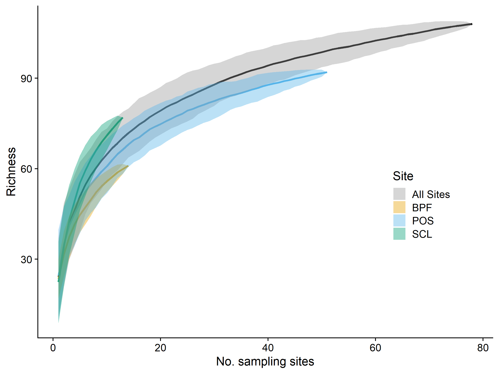
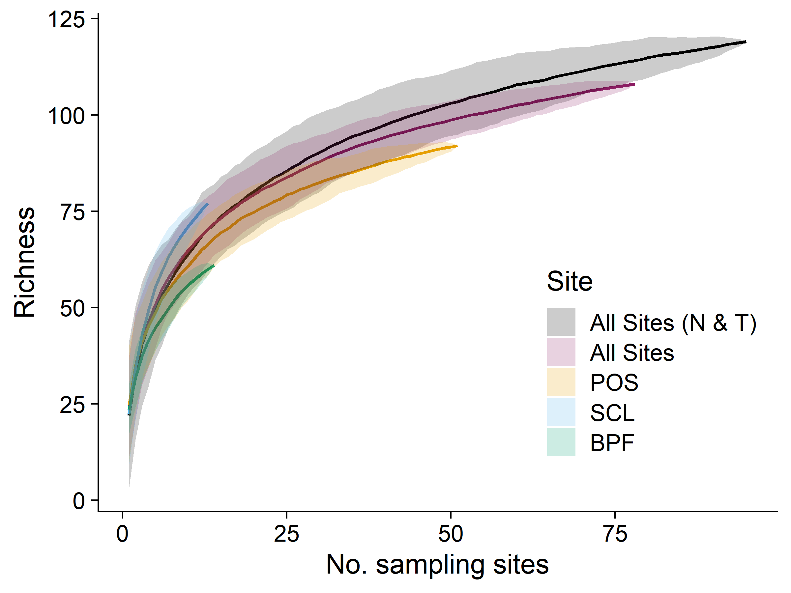

BeeSearch Species Accumulation Curves and Chao Richness
================
Dr. Riley M. Anderson
December 10, 2024

  

- [Overview](#overview)
  - [Summary of Results](#summary-of-results)
- [Honey bees](#honey-bees)
- [Singeltons](#singeltons)
- [Top 10 most abundant species](#top-10-most-abundant-species)
- [Species collected in all 3 sites](#species-collected-in-all-3-sites)
- [Only collected by net](#only-collected-by-net)
- [Species for which ZERO males were collected (net and
  trap)](#species-for-which-zero-males-were-collected-net-and-trap)
- [Species accumulation curves](#species-accumulation-curves)
- [Chao indices](#chao-indices)
  - [SAC with 4 lines and Chao
    estimates](#sac-with-4-lines-and-chao-estimates)
- [What is the turnover of species within sub-sites within
  years?](#what-is-the-turnover-of-species-within-sub-sites-within-years)
  - [POS](#pos)
  - [SCL](#scl)
  - [BPF](#bpf)
- [Is there greater overall diversity at SCL vs POS vs
  PBF?](#is-there-greater-overall-diversity-at-scl-vs-pos-vs-pbf)
  - [Session Information](#session-information)

## Overview

This analysis creates species accumulation curves at various scales: 1)
total records (all sites, all years), 2) at each site (all years)

### Summary of Results

Asymptote not reached with the total collection.

# Honey bees

| Site      | A_mellifera | total | Percent |
|:----------|------------:|------:|--------:|
| All sites |         575 | 25441 |    2.26 |
| BPF       |           8 |  1854 |    0.43 |
| POS       |         444 | 21691 |    2.05 |
| SCL       |         123 |  1896 |    6.49 |

# Singeltons

    ## [1] 20

| Species                     | Site |
|:----------------------------|:-----|
| Lasioglossum nigroviride    | BPF  |
| Colletes kincaidii          | POS  |
| Megachile onobrychidis      | POS  |
| Andrena subtilis            | POS  |
| Andrena gordoni             | POS  |
| Lasioglossum punctatoventre | POS  |
| Lasioglossum sedi           | POS  |
| Megachile fidelis           | POS  |
| Coelioxys gilensis          | POS  |
| Andrena miranda             | POS  |
| Andrena subaustralis        | POS  |
| Megachile gravita           | POS  |
| Agapostemon femoratus       | POS  |
| Nomada formula              | POS  |
| Andrena hippotes            | SCL  |
| Andrena buckelli            | SCL  |
| Osmia densa                 | SCL  |
| Lasioglossum yukonae        | SCL  |
| Andrena transnigra          | SCL  |
| Lasioglossum ovaliceps      | SCL  |

# Top 10 most abundant species

| Species                 | Records |
|:------------------------|--------:|
| Halictus tripartitus    |   11787 |
| Agapostemon texanus     |    2568 |
| Bombus vosnesenskii     |    2148 |
| Halictus rubicundus     |    1047 |
| Ceratina acantha        |     867 |
| Bombus flavifrons       |     782 |
| Bombus mixtus           |     619 |
| Apis mellifera          |     575 |
| Melissodes microsticta  |     538 |
| Lasioglossum villosulum |     484 |

# Species collected in all 3 sites

    ## [1] 51

| Species                  |
|:-------------------------|
| Agapostemon texanus      |
| Agapostemon virescens    |
| Andrena angustitarsata   |
| Andrena candida          |
| Andrena nigrihirta       |
| Andrena prunorum         |
| Andrena salicifloris     |
| Anthidium manicatum      |
| Apis mellifera           |
| Bombus fervidus          |
| Bombus flavifrons        |
| Bombus melanopygus       |
| Bombus mixtus            |
| Bombus sitkensis         |
| Bombus vosnesenskii      |
| Ceratina acantha         |
| Ceratina nanula          |
| Coelioxys rufitarsis     |
| Colletes fulgidus        |
| Halictus confusus        |
| Halictus rubicundus      |
| Halictus tripartitus     |
| Hoplitis producta        |
| Hylaeus modestus         |
| Lasioglossum aff. tenax  |
| Lasioglossum buccale     |
| Lasioglossum cooleyi     |
| Lasioglossum cressonii   |
| Lasioglossum incompletum |
| Lasioglossum kincaidii   |
| Lasioglossum knereri     |
| Lasioglossum laevissimum |
| Lasioglossum nevadense   |
| Lasioglossum pacatum     |
| Lasioglossum pacificum   |
| Lasioglossum ruidosense  |
| Lasioglossum villosulum  |
| Lasioglossum zonulum     |
| Megachile melanophaea    |
| Megachile montivaga      |
| Megachile perihirta      |
| Melissodes microsticta   |
| Melissodes rivalis       |
| Osmia albolateralis      |
| Osmia dolerosa           |
| Osmia giliarum           |
| Osmia lignaria           |
| Osmia proxima            |
| Osmia pusilla            |
| Osmia trifoliama         |
| Osmia tristella          |

# Only collected by net

    ## [1] 11

| Species                     |
|:----------------------------|
| Andrena vicina              |
| Andrena pallidifovea        |
| Lasioglossum titusi         |
| Andrena subtilis            |
| Andrena scurra              |
| Andrena gordoni             |
| Andrena piperi              |
| Lasioglossum punctatoventre |
| Lasioglossum sedi           |
| Megachile fidelis           |
| Coelioxys gilensis          |

# Species for which ZERO males were collected (net and trap)

| Short.label.name            | female | male |
|:----------------------------|-------:|-----:|
| Agapostemon femoratus       |      1 |    0 |
| Andrena crataegi            |      2 |    0 |
| Andrena gordoni             |      1 |    0 |
| Andrena hippotes            |      1 |    0 |
| Andrena knuthiana           |      5 |    0 |
| Andrena miranda             |      1 |    0 |
| Andrena nigrocaerulea       |      5 |    0 |
| Andrena pallidifovea        |      5 |    0 |
| Andrena piperi              |      6 |    0 |
| Andrena subtilis            |      1 |    0 |
| Andrena thaspii             |      4 |    0 |
| Bombus rufocinctus          |      2 |    0 |
| Coelioxys gilensis          |      1 |    0 |
| Coelioxys octodentata       |      3 |    0 |
| Diadasia enavata            |      2 |    0 |
| Halictus tripartitus        |  11787 |    0 |
| Hoplitis albifrons          |      6 |    0 |
| Hylaeus punctatus           |      4 |    0 |
| Lasioglossum cordleyi       |      3 |    0 |
| Lasioglossum kincaidii      |     31 |    0 |
| Lasioglossum ovaliceps      |      1 |    0 |
| Lasioglossum pacatum        |     52 |    0 |
| Lasioglossum punctatoventre |      1 |    0 |
| Lasioglossum ruidosense     |      6 |    0 |
| Lasioglossum sedi           |      1 |    0 |
| Lasioglossum titusi         |      2 |    0 |
| Lasioglossum yukonae        |      1 |    0 |
| Lasioglossum zephyrum       |      7 |    0 |
| Megachile fidelis           |      1 |    0 |
| Megachile onobrychidis      |      1 |    0 |
| Nomada formula              |      1 |    0 |
| Osmia densa                 |      1 |    0 |
| Osmia phaceliae             |      3 |    0 |
| Osmia texana                |      3 |    0 |

# Species accumulation curves

- Trap caught only (no net records)

<!-- -->

- Trap and net caught records

<!-- -->

<!-- -->

# Chao indices

From Anne Chao 1989:

Chao1 minimum species richness is defined non-parametrically as:

")

- Chao indices by site

|  chao1 | Site |
|-------:|:-----|
|  79.75 | BPF  |
| 115.14 | POS  |
|  92.04 | SCL  |

- Chao indices by site and season

|  chao1 | Site | Season |
|-------:|:-----|:-------|
|  34.90 | BPF  | early  |
|  86.00 | BPF  | late   |
|  70.06 | BPF  | mid    |
|  60.33 | POS  | early  |
|  63.67 | POS  | late   |
| 121.12 | POS  | mid    |
|  87.50 | SCL  | early  |
|  57.00 | SCL  | late   |
|  71.08 | SCL  | mid    |

<!-- -->

**Overall Chao1 minimum species richness across the sampling season.**
Estimated species richness in early (late March - mid May), mid (mid May
to mid July), and late (mid July - late September) time windows in the
sampling effort. Richness across sites converge in the mid-summer.

- Chao indices by station

|  chao1 | Station |
|-------:|:--------|
|  36.12 | BPF1    |
|  57.00 | BPF2    |
|  33.12 | BPF3    |
| 112.50 | BPF4    |
|  42.33 | BPF5    |
|  40.00 | BPF6    |
|  39.00 | BPF7    |
|  44.50 | BPF8    |
|  74.08 | POS1    |
|  18.67 | POS10   |
|  27.90 | POS11   |
|  52.12 | POS12   |
|  52.67 | POS13   |
|  18.00 | POS14   |
|  15.17 | POS15   |
|  17.00 | POS16   |
|  16.00 | POS17   |
|  11.50 | POS18   |
|  29.00 | POS19   |
| 101.17 | POS2    |
| 109.00 | POS20   |
|  47.00 | POS21   |
|  46.50 | POS22   |
|  54.00 | POS23   |
|  59.00 | POS24   |
|  48.40 | POS25   |
|  37.00 | POS26   |
|  41.40 | POS27   |
|  26.50 | POS28   |
|  93.67 | POS3    |
|  63.33 | POS4    |
|  66.50 | POS5    |
|  40.90 | POS6    |
|  32.10 | POS7    |
|  74.40 | POS8    |
|  51.08 | POS9    |
|  74.57 | SCL1    |
|  83.12 | SCL2    |
|  58.12 | SCL3    |
|  64.25 | SCL4    |
|  28.17 | SCL5    |

- Chao indices by station and year

|  chao1 | Station | Year |
|-------:|:--------|:-----|
|  62.50 | BPF1    | 2018 |
|  46.17 | BPF1    | 2019 |
|  41.67 | BPF2    | 2018 |
|  41.67 | BPF2    | 2019 |
|  29.00 | BPF3    | 2018 |
|  31.12 | BPF3    | 2019 |
|  24.90 | BPF4    | 2018 |
|  45.00 | BPF4    | 2019 |
|  31.12 | BPF5    | 2018 |
|  41.10 | BPF5    | 2019 |
|  22.50 | BPF6    | 2018 |
|  62.00 | BPF6    | 2019 |
|  39.00 | BPF7    | 2019 |
|  44.50 | BPF8    | 2019 |
|  18.67 | POS10   | 2017 |
|  27.90 | POS11   | 2017 |
|  30.00 | POS12   | 2017 |
|  38.00 | POS12   | 2019 |
|  28.50 | POS13   | 2017 |
|  35.17 | POS13   | 2018 |
|  51.00 | POS13   | 2020 |
|  18.00 | POS14   | 2017 |
|  15.17 | POS15   | 2017 |
|  17.00 | POS16   | 2017 |
|  16.00 | POS17   | 2017 |
|  11.50 | POS18   | 2017 |
|  29.00 | POS19   | 2017 |
|  32.14 | POS1    | 2014 |
|  40.00 | POS1    | 2015 |
|  40.12 | POS1    | 2016 |
|  58.00 | POS1    | 2019 |
|  13.00 | POS20   | 2017 |
|  40.00 | POS20   | 2018 |
|  40.50 | POS20   | 2020 |
|   6.00 | POS21   | 2017 |
|  47.00 | POS21   | 2019 |
|  46.50 | POS22   | 2018 |
|  54.00 | POS23   | 2018 |
|  53.00 | POS24   | 2018 |
|  22.67 | POS24   | 2020 |
|  48.40 | POS25   | 2019 |
|  37.00 | POS26   | 2020 |
|  41.40 | POS27   | 2020 |
|  26.50 | POS28   | 2020 |
|  31.25 | POS2    | 2014 |
|  43.33 | POS2    | 2015 |
|  79.67 | POS2    | 2016 |
|  35.12 | POS2    | 2019 |
|  44.17 | POS3    | 2014 |
|  41.50 | POS3    | 2015 |
|  39.00 | POS3    | 2016 |
|  47.17 | POS3    | 2018 |
|  44.25 | POS4    | 2016 |
|  36.79 | POS4    | 2018 |
|  47.00 | POS4    | 2020 |
|  65.00 | POS5    | 2017 |
|  48.40 | POS5    | 2019 |
|  56.00 | POS6    | 2017 |
|  34.60 | POS6    | 2019 |
|  32.10 | POS7    | 2017 |
|  40.12 | POS8    | 2017 |
|  57.50 | POS8    | 2019 |
|  64.50 | POS9    | 2017 |
|  46.67 | POS9    | 2018 |
|  35.33 | POS9    | 2020 |
|  39.50 | SCL1    | 2014 |
|  61.00 | SCL1    | 2015 |
| 100.67 | SCL1    | 2016 |
|  38.25 | SCL2    | 2014 |
|  60.00 | SCL2    | 2015 |
|  39.50 | SCL2    | 2016 |
|  13.00 | SCL3    | 2014 |
|  51.00 | SCL3    | 2015 |
|  75.00 | SCL3    | 2016 |
|  20.60 | SCL4    | 2014 |
| 101.25 | SCL4    | 2015 |
|  36.12 | SCL4    | 2016 |
|  28.17 | SCL5    | 2016 |

<!-- -->

**Species richness across sites and sampling years** Points are mean
Chao1 estimated species richness, triangles are raw species counts at
each substation within each site. Chao richness estimates are lifted by
an additive parameter that accounts for rare species likely missed in
the sampling. The data exclude some morphospecies (see methods), and all
net caught records.

## SAC with 4 lines and Chao estimates

<!-- -->

# What is the turnover of species within sub-sites within years?

### POS

<!-- -->

### SCL

<!-- -->

### BPF

<!-- -->

# Is there greater overall diversity at SCL vs POS vs PBF?

| Site | Shannon | Simpson | InvSimpson | UnbiasedSimpson | FisherAlpha |
|:-----|--------:|--------:|-----------:|----------------:|------------:|
| POS  |    2.11 |    0.69 |       3.26 |            0.69 |       20.87 |
| BPF  |    3.17 |    0.93 |      14.47 |            0.93 |       17.29 |
| SCL  |    3.12 |    0.92 |      12.27 |            0.92 |       20.49 |

Diversity is similar across all 3 sites.

## Session Information

    R version 4.2.3 (2023-03-15 ucrt)
    Platform: x86_64-w64-mingw32/x64 (64-bit)
    Running under: Windows 10 x64 (build 19045)

    Matrix products: default

    locale:
    [1] LC_COLLATE=English_United States.utf8 
    [2] LC_CTYPE=English_United States.utf8   
    [3] LC_MONETARY=English_United States.utf8
    [4] LC_NUMERIC=C                          
    [5] LC_TIME=English_United States.utf8    

    attached base packages:
    [1] stats     graphics  grDevices utils     datasets  methods   base     

    other attached packages:
     [1] fossil_0.4.0      shapefiles_0.7.2  foreign_0.8-84    maps_3.4.2       
     [5] sp_2.1-4          knitr_1.47        adespatial_0.3-23 vegan_2.6-6.1    
     [9] lattice_0.20-45   permute_0.9-7     cowplot_1.1.3     lubridate_1.9.3  
    [13] forcats_1.0.0     stringr_1.5.1     dplyr_1.1.4       purrr_1.0.2      
    [17] readr_2.1.5       tidyr_1.3.1       tibble_3.2.1      ggplot2_3.5.1    
    [21] tidyverse_2.0.0  

    loaded via a namespace (and not attached):
     [1] nlme_3.1-162        sf_1.0-16           RColorBrewer_1.1-3 
     [4] progress_1.2.3      httr_1.4.7          rprojroot_2.0.4    
     [7] tools_4.2.3         utf8_1.2.4          R6_2.5.1           
    [10] KernSmooth_2.23-20  DBI_1.2.3           spData_2.3.1       
    [13] mgcv_1.8-42         colorspace_2.1-0    ade4_1.7-22        
    [16] withr_3.0.0         tidyselect_1.2.1    prettyunits_1.2.0  
    [19] compiler_4.2.3      cli_3.6.2           adephylo_1.1-16    
    [22] xml2_1.3.6          labeling_0.4.3      scales_1.3.0       
    [25] classInt_0.4-10     proxy_0.4-27        digest_0.6.35      
    [28] rmarkdown_2.27      jpeg_0.1-10         pkgconfig_2.0.3    
    [31] htmltools_0.5.8.1   highr_0.11          fastmap_1.2.0      
    [34] rlang_1.1.4         rstudioapi_0.16.0   shiny_1.8.1.1      
    [37] farver_2.1.2        generics_0.1.3      spdep_1.3-5        
    [40] magrittr_2.0.3      s2_1.1.6            interp_1.1-6       
    [43] Matrix_1.5-3        Rcpp_1.0.12         munsell_0.5.1      
    [46] fansi_1.0.6         ape_5.8             lifecycle_1.0.4    
    [49] stringi_1.8.4       yaml_2.3.8          MASS_7.3-58.2      
    [52] plyr_1.8.9          adegraphics_1.0-21  grid_4.2.3         
    [55] parallel_4.2.3      promises_1.3.0      crayon_1.5.2       
    [58] adegenet_2.1.10     deldir_2.0-4        rncl_0.8.7         
    [61] splines_4.2.3       hms_1.1.3           pillar_1.9.0       
    [64] igraph_2.0.3        uuid_1.2-0          boot_1.3-28.1      
    [67] seqinr_4.2-36       reshape2_1.4.4      wk_0.9.1           
    [70] XML_3.99-0.16.1     glue_1.7.0          evaluate_0.24.0    
    [73] RNeXML_2.4.11       latticeExtra_0.6-30 png_0.1-8          
    [76] vctrs_0.6.5         tzdb_0.4.0          httpuv_1.6.15      
    [79] gtable_0.3.5        xfun_0.44           mime_0.12          
    [82] phylobase_0.8.12    xtable_1.8-4        e1071_1.7-14       
    [85] later_1.3.2         class_7.3-21        units_0.8-5        
    [88] cluster_2.1.4       timechange_0.3.0   
