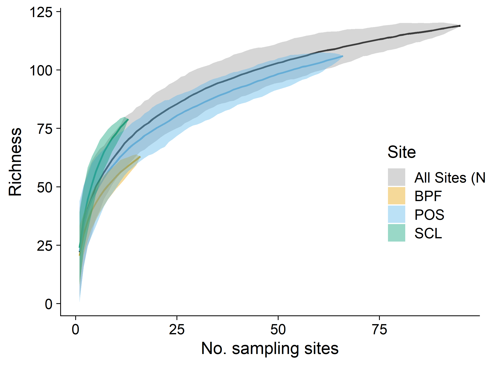
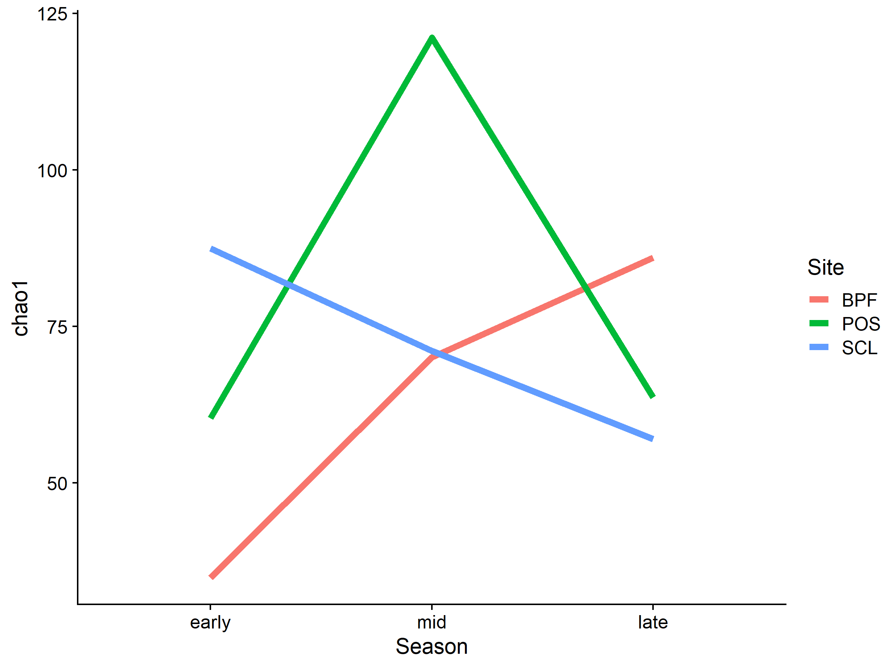

BeeSearch Species Accumulation Curves and Chao Richness
================
Dr. Riley M. Anderson
October 29, 2024

  

- [Overview](#overview)
  - [Summary of Results](#summary-of-results)
- [Species accumulation curves](#species-accumulation-curves)
- [Chao indices](#chao-indices)
- [What is the turnover of species within sub-sites within
  years?](#what-is-the-turnover-of-species-within-sub-sites-within-years)
  - [POS](#pos)
  - [SCL](#scl)
  - [BPF](#bpf)
- [Is there greater overall diversity at SCL vs POS vs
  PBF?](#is-there-greater-overall-diversity-at-scl-vs-pos-vs-pbf)
  - [Session Information](#session-information)

## Overview

This analysis creates species accumulation curves at various scales: 1)
total records (all sites, all years), 2) at each site (all years)

### Summary of Results

Asymptote not reached with the total collection.

| Site | A_mellifera | total | Percent |
|:-----|------------:|------:|--------:|
| BPF  |           8 |  1810 |    0.44 |
| POS  |         329 | 19108 |    1.72 |
| SCL  |         123 |  1886 |    6.52 |

# Species accumulation curves

- Trap caught only (no net records)

<!-- -->

- Trap and net caught records

<!-- -->

# Chao indices

From Anne Chao 1989:

Chao1 minimum species richness is defined non-parametrically as:

")

- Chao indices by site

|  chao1 | Site |
|-------:|:-----|
|  92.79 | BPF  |
| 108.46 | POS  |
| 104.35 | SCL  |

- Chao indices by site and season

|  chao1 | Site | Season |
|-------:|:-----|:-------|
|  42.33 | BPF  | early  |
|  87.00 | BPF  | late   |
|  81.00 | BPF  | mid    |
|  78.29 | POS  | early  |
| 105.50 | POS  | late   |
|  89.00 | POS  | mid    |
|  97.79 | SCL  | early  |
|  56.12 | SCL  | late   |
|  84.33 | SCL  | mid    |

<!-- -->

**Overall Chao1 minimum species richness across the sampling season.**
Estimated species richness in early (late March - mid May), mid (mid May
to mid July), and late (mid July - late September) time windows in the
sampling effort. Richness across sites converge in the mid-summer.

- Chao indices by station

| chao1 | Station |
|------:|:--------|
| 38.40 | BPF1    |
| 62.17 | BPF2    |
| 32.90 | BPF3    |
| 79.00 | BPF4    |
| 49.00 | BPF5    |
| 43.10 | BPF6    |
| 41.07 | BPF7    |
| 44.50 | BPF8    |
| 78.57 | POS1    |
| 18.67 | POS10   |
| 33.10 | POS11   |
| 53.12 | POS12   |
| 36.17 | POS13   |
| 96.00 | POS2    |
| 50.90 | POS20   |
| 50.45 | POS21   |
| 51.12 | POS22   |
| 61.25 | POS23   |
| 53.00 | POS24   |
| 49.40 | POS25   |
| 73.14 | POS3    |
| 50.29 | POS4    |
| 77.00 | POS5    |
| 41.90 | POS6    |
| 35.00 | POS7    |
| 75.40 | POS8    |
| 51.12 | POS9    |
| 87.79 | SCL1    |
| 84.12 | SCL2    |
| 58.12 | SCL3    |
| 74.56 | SCL4    |
| 32.67 | SCL5    |

- Chao indices by station and year

|  chao1 | Station | Year |
|-------:|:--------|:-----|
|  73.00 | BPF1    | 2018 |
|  56.17 | BPF1    | 2019 |
|  46.17 | BPF2    | 2018 |
|  41.67 | BPF2    | 2019 |
|  32.12 | BPF3    | 2018 |
|  34.50 | BPF3    | 2019 |
|  24.90 | BPF4    | 2018 |
|  44.12 | BPF4    | 2019 |
|  32.12 | BPF5    | 2018 |
|  48.90 | BPF5    | 2019 |
|  25.12 | BPF6    | 2018 |
|  62.00 | BPF6    | 2019 |
|  41.07 | BPF7    | 2019 |
|  44.50 | BPF8    | 2019 |
|  18.67 | POS10   | 2017 |
|  33.10 | POS11   | 2017 |
|  34.25 | POS12   | 2017 |
|  39.00 | POS12   | 2019 |
|  36.17 | POS13   | 2018 |
|  40.00 | POS1    | 2015 |
|  44.00 | POS1    | 2016 |
|  64.17 | POS1    | 2019 |
|  50.90 | POS20   | 2018 |
|  50.45 | POS21   | 2019 |
|  51.12 | POS22   | 2018 |
|  61.25 | POS23   | 2018 |
|  53.00 | POS24   | 2018 |
|  49.40 | POS25   | 2019 |
|  46.08 | POS2    | 2015 |
|  86.17 | POS2    | 2016 |
|  41.12 | POS2    | 2019 |
|  45.67 | POS3    | 2015 |
|  45.40 | POS3    | 2016 |
|  52.00 | POS3    | 2018 |
|  45.25 | POS4    | 2016 |
|  40.14 | POS4    | 2018 |
|  72.25 | POS5    | 2017 |
|  56.60 | POS5    | 2019 |
|  41.00 | POS6    | 2017 |
|  35.60 | POS6    | 2019 |
|  35.00 | POS7    | 2017 |
|  41.12 | POS8    | 2017 |
|  58.50 | POS8    | 2019 |
|  86.50 | POS9    | 2017 |
|  43.50 | POS9    | 2018 |
|  48.00 | SCL1    | 2014 |
|  59.90 | SCL1    | 2015 |
| 116.67 | SCL1    | 2016 |
|  38.25 | SCL2    | 2014 |
|  61.00 | SCL2    | 2015 |
|  43.12 | SCL2    | 2016 |
|  13.00 | SCL3    | 2014 |
|  51.00 | SCL3    | 2015 |
|  75.00 | SCL3    | 2016 |
|  22.90 | SCL4    | 2014 |
| 111.00 | SCL4    | 2015 |
|  39.50 | SCL4    | 2016 |
|  32.67 | SCL5    | 2016 |

<!-- -->

**Species richness across sites and sampling years** Points are mean
Chao1 estimated species richness, triangles are raw species counts at
each substation within each site. Chao richness estimates are lifted by
an additive parameter that accounts for rare species likely missed in
the sampling. The data exclude some morphospecies (see methods), and all
net caught records.

# What is the turnover of species within sub-sites within years?

### POS

<!-- -->

### SCL

<!-- -->

### BPF

<!-- -->

# Is there greater overall diversity at SCL vs POS vs PBF?

| Site | Shannon | Simpson | InvSimpson | UnbiasedSimpson | FisherAlpha |
|:-----|--------:|--------:|-----------:|----------------:|------------:|
| POS  |    2.11 |    0.69 |       3.26 |            0.69 |       20.87 |
| BPF  |    3.17 |    0.93 |      14.47 |            0.93 |       17.29 |
| SCL  |    3.12 |    0.92 |      12.27 |            0.92 |       20.49 |

Diversity is similar across all 3 sites.

## Session Information

    R version 4.2.3 (2023-03-15 ucrt)
    Platform: x86_64-w64-mingw32/x64 (64-bit)
    Running under: Windows 10 x64 (build 19045)

    Matrix products: default

    locale:
    [1] LC_COLLATE=English_United States.utf8 
    [2] LC_CTYPE=English_United States.utf8   
    [3] LC_MONETARY=English_United States.utf8
    [4] LC_NUMERIC=C                          
    [5] LC_TIME=English_United States.utf8    

    attached base packages:
    [1] stats     graphics  grDevices utils     datasets  methods   base     

    other attached packages:
     [1] fossil_0.4.0      shapefiles_0.7.2  foreign_0.8-84    maps_3.4.2       
     [5] sp_2.1-4          knitr_1.47        adespatial_0.3-23 vegan_2.6-6.1    
     [9] lattice_0.20-45   permute_0.9-7     cowplot_1.1.3     lubridate_1.9.3  
    [13] forcats_1.0.0     stringr_1.5.1     dplyr_1.1.4       purrr_1.0.2      
    [17] readr_2.1.5       tidyr_1.3.1       tibble_3.2.1      ggplot2_3.5.1    
    [21] tidyverse_2.0.0  

    loaded via a namespace (and not attached):
     [1] nlme_3.1-162        sf_1.0-16           RColorBrewer_1.1-3 
     [4] progress_1.2.3      httr_1.4.7          rprojroot_2.0.4    
     [7] tools_4.2.3         utf8_1.2.4          R6_2.5.1           
    [10] KernSmooth_2.23-20  DBI_1.2.3           spData_2.3.1       
    [13] mgcv_1.8-42         colorspace_2.1-0    ade4_1.7-22        
    [16] withr_3.0.0         tidyselect_1.2.1    prettyunits_1.2.0  
    [19] compiler_4.2.3      cli_3.6.2           adephylo_1.1-16    
    [22] xml2_1.3.6          labeling_0.4.3      scales_1.3.0       
    [25] classInt_0.4-10     proxy_0.4-27        digest_0.6.35      
    [28] rmarkdown_2.27      jpeg_0.1-10         pkgconfig_2.0.3    
    [31] htmltools_0.5.8.1   highr_0.11          fastmap_1.2.0      
    [34] rlang_1.1.4         rstudioapi_0.16.0   shiny_1.8.1.1      
    [37] farver_2.1.2        generics_0.1.3      spdep_1.3-5        
    [40] magrittr_2.0.3      s2_1.1.6            interp_1.1-6       
    [43] Matrix_1.5-3        Rcpp_1.0.12         munsell_0.5.1      
    [46] fansi_1.0.6         ape_5.8             lifecycle_1.0.4    
    [49] stringi_1.8.4       yaml_2.3.8          MASS_7.3-58.2      
    [52] plyr_1.8.9          adegraphics_1.0-21  grid_4.2.3         
    [55] parallel_4.2.3      promises_1.3.0      crayon_1.5.2       
    [58] adegenet_2.1.10     deldir_2.0-4        rncl_0.8.7         
    [61] splines_4.2.3       hms_1.1.3           pillar_1.9.0       
    [64] igraph_2.0.3        uuid_1.2-0          boot_1.3-28.1      
    [67] seqinr_4.2-36       reshape2_1.4.4      wk_0.9.1           
    [70] XML_3.99-0.16.1     glue_1.7.0          evaluate_0.24.0    
    [73] RNeXML_2.4.11       latticeExtra_0.6-30 png_0.1-8          
    [76] vctrs_0.6.5         tzdb_0.4.0          httpuv_1.6.15      
    [79] gtable_0.3.5        xfun_0.44           mime_0.12          
    [82] phylobase_0.8.12    xtable_1.8-4        e1071_1.7-14       
    [85] later_1.3.2         class_7.3-21        units_0.8-5        
    [88] cluster_2.1.4       timechange_0.3.0   
