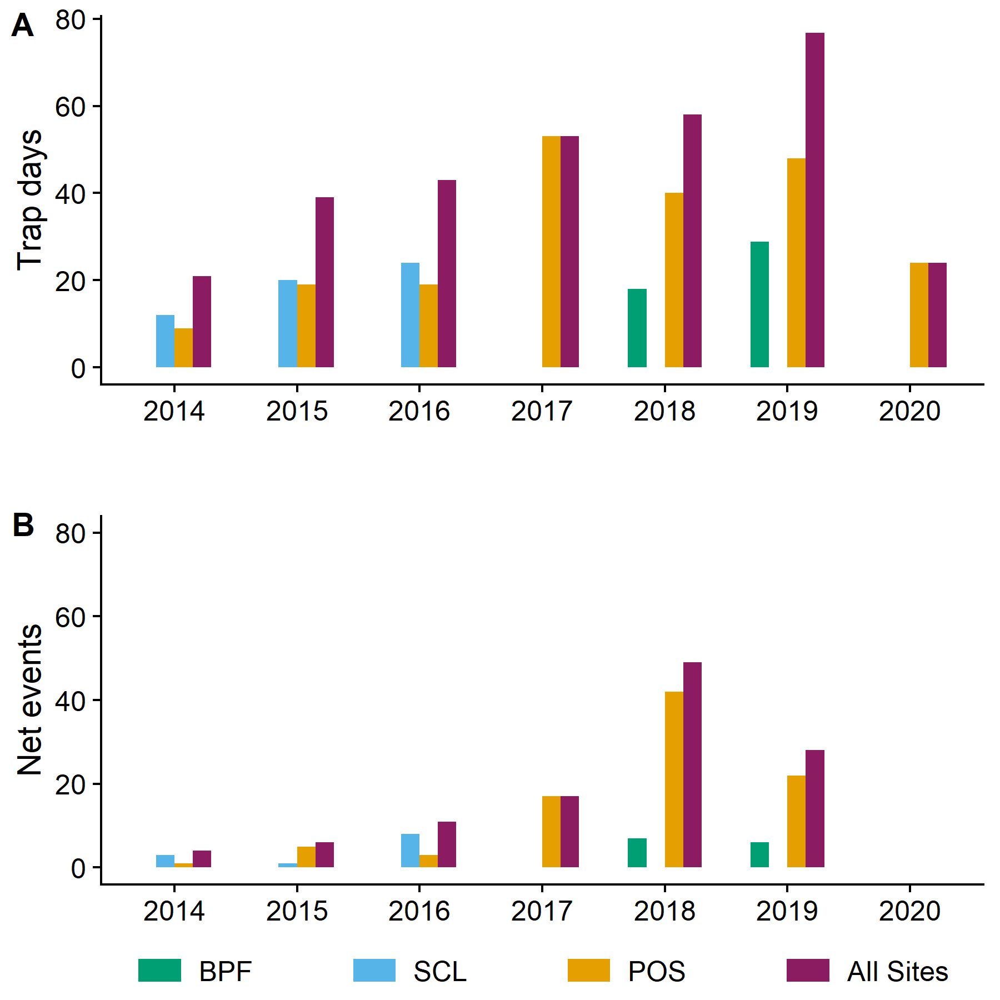

BeeSearch Collection Effort
================
Dr. Riley M. Anderson
January 07, 2025

  

- [Overview](#overview)
- [Session Information](#session-information)

## Overview

This analysis creates Figure S1. Collecting effort across years at all
sites. a) Trap days expressed as a standard trap set over a 24-hour
period. (BPF figures expressed as equivalents with reference to numbers
of specimens collected by standard trap sets at other sites.) b) Net
collecting events.

<!-- -->

## Session Information

    R version 4.2.3 (2023-03-15 ucrt)
    Platform: x86_64-w64-mingw32/x64 (64-bit)
    Running under: Windows 10 x64 (build 19045)

    Matrix products: default

    locale:
    [1] LC_COLLATE=English_United States.utf8 
    [2] LC_CTYPE=English_United States.utf8   
    [3] LC_MONETARY=English_United States.utf8
    [4] LC_NUMERIC=C                          
    [5] LC_TIME=English_United States.utf8    

    attached base packages:
    [1] stats     graphics  grDevices utils     datasets  methods   base     

    other attached packages:
     [1] cowplot_1.1.3   lubridate_1.9.3 forcats_1.0.0   stringr_1.5.1  
     [5] dplyr_1.1.4     purrr_1.0.2     readr_2.1.5     tidyr_1.3.1    
     [9] tibble_3.2.1    ggplot2_3.5.1   tidyverse_2.0.0

    loaded via a namespace (and not attached):
     [1] highr_0.11        pillar_1.9.0      compiler_4.2.3    tools_4.2.3      
     [5] digest_0.6.35     timechange_0.3.0  evaluate_0.24.0   lifecycle_1.0.4  
     [9] gtable_0.3.5      pkgconfig_2.0.3   rlang_1.1.4       cli_3.6.2        
    [13] rstudioapi_0.16.0 yaml_2.3.8        xfun_0.44         fastmap_1.2.0    
    [17] withr_3.0.0       knitr_1.47        generics_0.1.3    vctrs_0.6.5      
    [21] hms_1.1.3         rprojroot_2.0.4   grid_4.2.3        tidyselect_1.2.1 
    [25] glue_1.7.0        R6_2.5.1          fansi_1.0.6       rmarkdown_2.27   
    [29] farver_2.1.2      tzdb_0.4.0        magrittr_2.0.3    scales_1.3.0     
    [33] htmltools_0.5.8.1 colorspace_2.1-0  labeling_0.4.3    utf8_1.2.4       
    [37] stringi_1.8.4     munsell_0.5.1    
