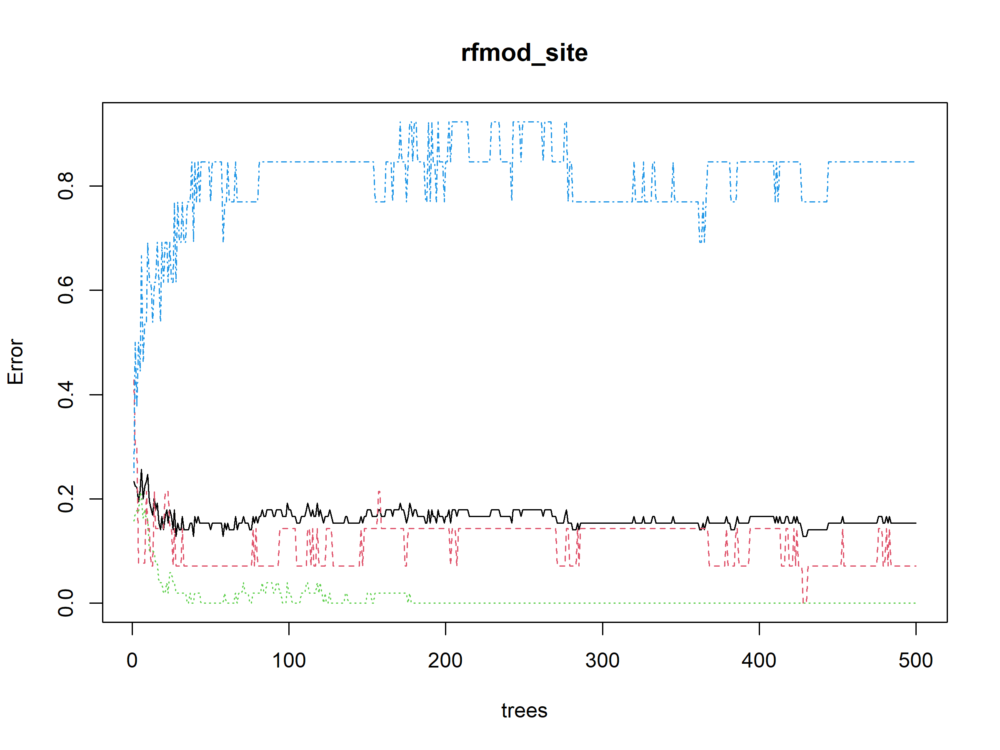
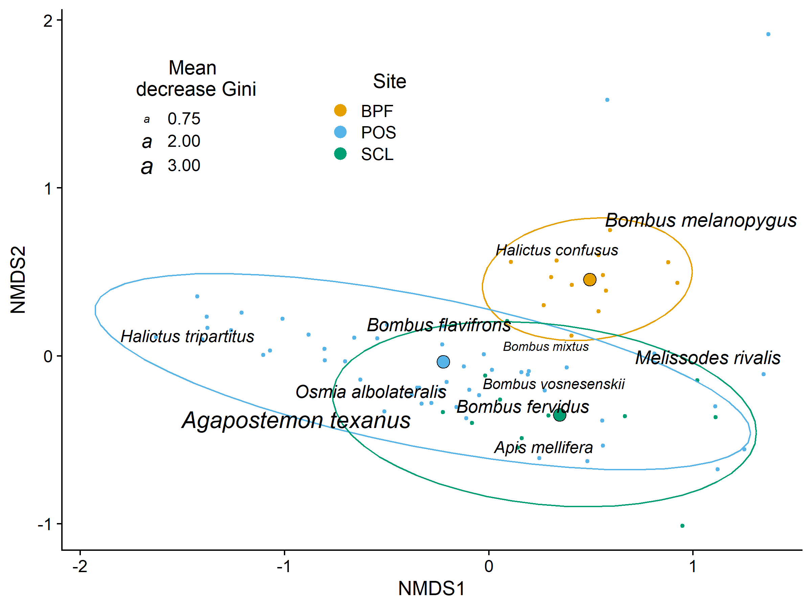

BeeSearch Multivariate Analyses
================
Dr. Riley M. Anderson
December 10, 2024

  

- [Overview](#overview)
  - [Summary of Results](#summary-of-results)
- [Across sites](#across-sites)
  - [Site classification by species composition (Random
    Forest)](#site-classification-by-species-composition-random-forest)
  - [NMDS by Site figure (include
    this)](#nmds-by-site-figure-include-this)
- [Session Information](#session-information)

## Overview

What is this analysis about?

### Summary of Results

- 

## Across sites

    ## Permutation test for adonis under reduced model
    ## Terms added sequentially (first to last)
    ## Permutation: free
    ## Number of permutations: 999
    ## 
    ## adonis2(formula = site_matrix ~ Site * Year, data = site_meta, method = "bray")
    ##           Df SumOfSqs      R2      F Pr(>F)   
    ## Site       2   1.0050 0.05314 2.1105  0.008 **
    ## Year       1   0.4331 0.02290 1.8188  0.081 . 
    ## Site:Year  2   0.3298 0.01744 0.6926  0.820   
    ## Residual  72  17.1432 0.90652                 
    ## Total     77  18.9111 1.00000                 
    ## ---
    ## Signif. codes:  0 '***' 0.001 '**' 0.01 '*' 0.05 '.' 0.1 ' ' 1
    ## 
    ## Permutation test for homogeneity of multivariate dispersions
    ## Permutation: free
    ## Number of permutations: 999
    ## 
    ## Response: Distances
    ##           Df  Sum Sq  Mean Sq      F N.Perm Pr(>F)
    ## Groups     6 0.13306 0.022176 1.5361    999  0.183
    ## Residuals 71 1.02498 0.014436
    ## 
    ## Permutation test for homogeneity of multivariate dispersions
    ## Permutation: free
    ## Number of permutations: 999
    ## 
    ## Response: Distances
    ##           Df  Sum Sq  Mean Sq      F N.Perm Pr(>F)   
    ## Groups     2 0.18685 0.093426 6.8005    999  0.003 **
    ## Residuals 75 1.03036 0.013738                        
    ## ---
    ## Signif. codes:  0 '***' 0.001 '**' 0.01 '*' 0.05 '.' 0.1 ' ' 1

### Site classification by species composition (Random Forest)

    ## Random Forest 
    ## 
    ##  78 samples
    ## 108 predictors
    ##   3 classes: 'BPF', 'POS', 'SCL' 
    ## 
    ## No pre-processing
    ## Resampling: Bootstrapped (25 reps) 
    ## Summary of sample sizes: 78, 78, 78, 78, 78, 78, ... 
    ## Resampling results across tuning parameters:
    ## 
    ##   mtry  Accuracy   Kappa    
    ##     2   0.6923958  0.1828966
    ##    55   0.8299202  0.6348494
    ##   108   0.8073789  0.5953123
    ## 
    ## Accuracy was used to select the optimal model using the largest value.
    ## The final value used for the model was mtry = 55.
    ## 
    ## Call:
    ##  randomForest(x = select(rf_matrix, -Year, -Station, -StationYear,      -Site), y = rf_matrix$Site, mtry = 55, importance = T, nPerm = 999,      proximity = T) 
    ##                Type of random forest: classification
    ##                      Number of trees: 500
    ## No. of variables tried at each split: 55
    ## 
    ##         OOB estimate of  error rate: 14.1%
    ## Confusion matrix:
    ##     BPF POS SCL class.error
    ## BPF  12   2   0  0.14285714
    ## POS   1  49   1  0.03921569
    ## SCL   0   7   6  0.53846154

|                          |    BPF |    POS |   SCL | MeanDecreaseAccuracy | MeanDecreaseGini |
|:-------------------------|-------:|-------:|------:|---------------------:|-----------------:|
| Halictus tripartitus     |  8.342 | 11.734 | 5.702 |               12.930 |            3.439 |
| Agapostemon texanus      | 10.306 |  8.460 | 0.523 |               10.848 |            2.756 |
| Bombus melanopygus       |  8.207 |  4.355 | 3.057 |                8.658 |            1.796 |
| Bombus flavifrons        |  6.449 |  6.395 | 6.791 |                9.811 |            1.783 |
| Osmia albolateralis      |  6.433 |  6.085 | 3.078 |                7.938 |            1.645 |
| Apis mellifera           |  7.592 |  4.177 | 2.978 |                7.618 |            1.623 |
| Melissodes rivalis       |  2.279 |  7.759 | 2.792 |                7.533 |            1.607 |
| Halictus confusus        |  8.542 |  1.890 | 2.859 |                7.621 |            1.408 |
| Bombus fervidus          |  7.137 |  5.336 | 0.904 |                6.884 |            1.307 |
| Bombus vosnesenskii      |  2.185 |  6.720 | 0.486 |                6.572 |            1.160 |
| Lasioglossum incompletum |  4.572 |  1.803 | 1.720 |                4.252 |            0.925 |

<!-- -->

**Random Forest classification of site by species composition.** The
model was tuned without pre-processing. Bootstrapped resampling used 25
replicates. The model was built with 500 trees and model tuning
maximized accuracy at 55 variables/split. Overall model accuracy was
82%. Out of bag estimate of error rate was 16.7%. This lends further
support to the NMDS figure below, species composition is very similar
across SCL and POS, but BPF sites have different community composition
compared to the other two sites.

The table above shows the species most representative of the community
differences used to make the above classifications. These species are
the top 10th percentile of ranked variable importance (mean decrease in
Gini score, a measure of the total decrease in node impurities from
splitting on the variable, averaged over all trees).

### NMDS by Site figure (include this)

<!-- -->
**Variation in community composition across sites.** Bee species are
plotted on the first two axes of a three-dimensional non-metric
multidimensional scaling ordination of the 58 combinations of station
(subsite) and year, across the three sites. Small points are the
individual station/year combinations. Large points are the centroids of
the three sites. Ellipses are 95% confidence intervals around the site
centroids. Bees species shown are the most representative (top 10th
percentile of a random forest analysis) of the compositional differences
among sites. Text size of the labels is proportional to variable
importance score (mean decrease in Gini score).

| Species              | BPF |   POS | SCL | MeanDecreaseAccuracy | MeanDecreaseGini |
|:---------------------|----:|------:|----:|---------------------:|-----------------:|
| Halictus tripartitus |  38 | 11603 | 146 |               12.930 |            3.439 |
| Agapostemon texanus  |  24 |  2269 | 275 |               10.848 |            2.756 |
| Bombus melanopygus   |  89 |    23 |   2 |                8.658 |            1.796 |
| Osmia albolateralis  |   2 |   204 |   9 |                7.938 |            1.645 |
| Apis mellifera       |   8 |   444 | 123 |                7.618 |            1.623 |
| Melissodes rivalis   |  32 |    17 |  28 |                7.533 |            1.607 |
| Halictus confusus    |  97 |   108 |   3 |                7.621 |            1.408 |
| Bombus fervidus      |   9 |   196 |  51 |                6.884 |            1.307 |
| Bombus vosnesenskii  | 248 |  1556 | 344 |                6.572 |            1.160 |
| Bombus mixtus        | 135 |   433 |  51 |                   NA |               NA |

## Session Information

    R version 4.2.3 (2023-03-15 ucrt)
    Platform: x86_64-w64-mingw32/x64 (64-bit)
    Running under: Windows 10 x64 (build 19045)

    Matrix products: default

    locale:
    [1] LC_COLLATE=English_United States.utf8 
    [2] LC_CTYPE=English_United States.utf8   
    [3] LC_MONETARY=English_United States.utf8
    [4] LC_NUMERIC=C                          
    [5] LC_TIME=English_United States.utf8    

    attached base packages:
    [1] stats     graphics  grDevices utils     datasets  methods   base     

    other attached packages:
     [1] knitr_1.47           caret_6.0-94         randomForest_4.7-1.1
     [4] vegan_2.6-6.1        lattice_0.20-45      permute_0.9-7       
     [7] cowplot_1.1.3        lubridate_1.9.3      forcats_1.0.0       
    [10] stringr_1.5.1        dplyr_1.1.4          purrr_1.0.2         
    [13] readr_2.1.5          tidyr_1.3.1          tibble_3.2.1        
    [16] ggplot2_3.5.1        tidyverse_2.0.0     

    loaded via a namespace (and not attached):
     [1] splines_4.2.3        foreach_1.5.2        prodlim_2023.08.28  
     [4] highr_0.11           stats4_4.2.3         ggrepel_0.9.5       
     [7] yaml_2.3.8           globals_0.16.3       ipred_0.9-14        
    [10] pillar_1.9.0         glue_1.7.0           pROC_1.18.5         
    [13] digest_0.6.35        RColorBrewer_1.1-3   hardhat_1.4.0       
    [16] colorspace_2.1-0     recipes_1.0.10       htmltools_0.5.8.1   
    [19] Matrix_1.5-3         plyr_1.8.9           timeDate_4032.109   
    [22] pkgconfig_2.0.3      listenv_0.9.1        scales_1.3.0        
    [25] gower_1.0.1          lava_1.8.0           tzdb_0.4.0          
    [28] proxy_0.4-27         timechange_0.3.0     mgcv_1.8-42         
    [31] farver_2.1.2         generics_0.1.3       withr_3.0.0         
    [34] nnet_7.3-18          cli_3.6.2            survival_3.5-3      
    [37] magrittr_2.0.3       evaluate_0.24.0      fansi_1.0.6         
    [40] future_1.33.2        parallelly_1.37.1    nlme_3.1-162        
    [43] MASS_7.3-58.2        class_7.3-21         tools_4.2.3         
    [46] data.table_1.15.4    hms_1.1.3            lifecycle_1.0.4     
    [49] munsell_0.5.1        cluster_2.1.4        e1071_1.7-14        
    [52] compiler_4.2.3       rlang_1.1.4          grid_4.2.3          
    [55] iterators_1.0.14     rstudioapi_0.16.0    labeling_0.4.3      
    [58] rmarkdown_2.27       gtable_0.3.5         ModelMetrics_1.2.2.2
    [61] codetools_0.2-19     reshape2_1.4.4       R6_2.5.1            
    [64] fastmap_1.2.0        future.apply_1.11.2  utf8_1.2.4          
    [67] rprojroot_2.0.4      stringi_1.8.4        parallel_4.2.3      
    [70] Rcpp_1.0.12          vctrs_0.6.5          rpart_4.1.23        
    [73] tidyselect_1.2.1     xfun_0.44           
