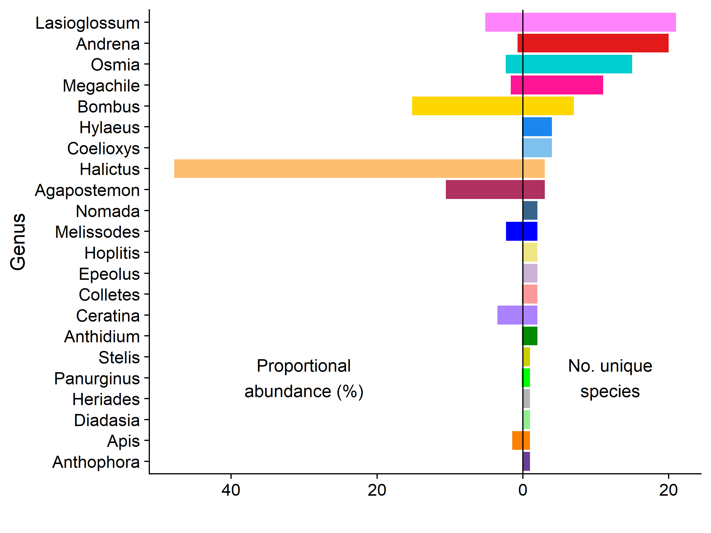
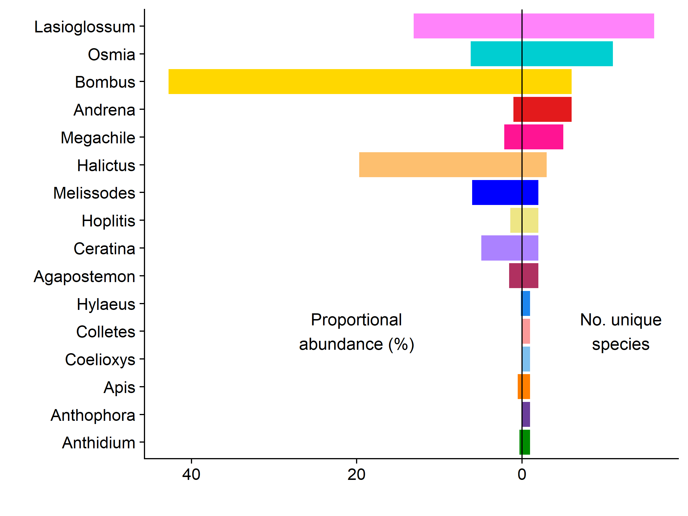
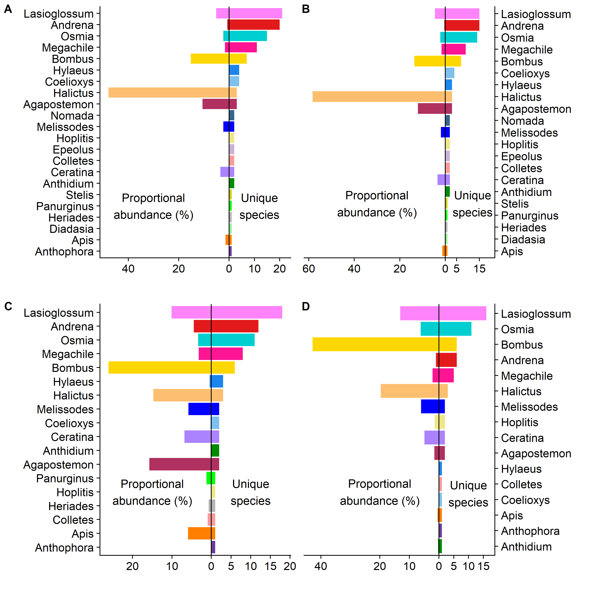
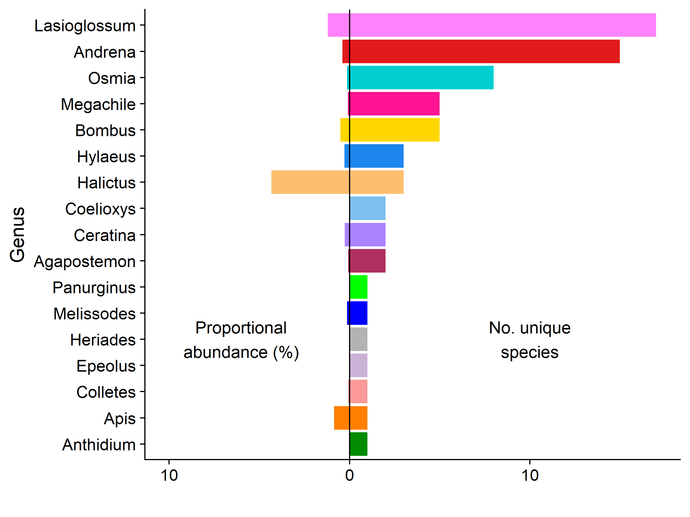
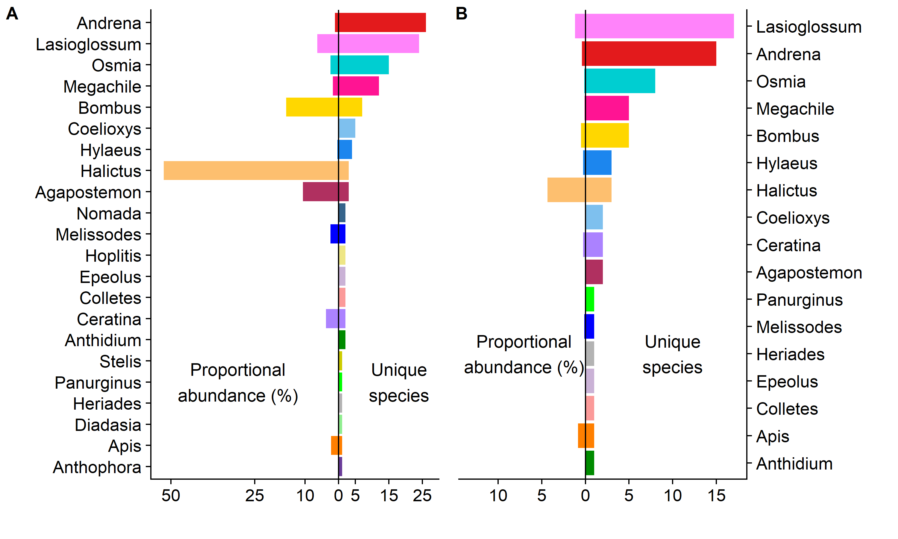

BeeSearch genus plots
================
Dr. Riley M. Anderson
December 10, 2024

  

- [Overview](#overview)
- [Descriptive measures of genera](#descriptive-measures-of-genera)
  - [All sites together](#all-sites-together)
  - [POS](#pos)
  - [SCL](#scl)
  - [BPF](#bpf)
  - [All genus plots together in one
    figure:](#all-genus-plots-together-in-one-figure)
  - [All sites together (trap and net
    records)](#all-sites-together-trap-and-net-records)
  - [All sites together (net records
    only)](#all-sites-together-net-records-only)
  - [Genus Trap and Net, And Net Only](#genus-trap-and-net-and-net-only)
  - [Genus Trap only and Net only](#genus-trap-only-and-net-only)
  - [All Genus plots](#all-genus-plots)
  - [Session Information](#session-information)

## Overview

This analysis plots the count of unique species/genus and the
proportional abundance of each genus.

# Descriptive measures of genera

## All sites together

<!-- -->

## POS

<!-- -->

## SCL

<!-- -->

## BPF

<!-- -->

## All genus plots together in one figure:

<!-- -->

**Proportional abundance and unique species** A) All sites collectively,
B) POS, C) SCL, and D) BPF. Data are from trap collected records and
exclude all net caught records. Data are pooled across years.

## All sites together (trap and net records)

<!-- -->

## All sites together (net records only)

<!-- -->

## Genus Trap and Net, And Net Only

<!-- -->

**Proportional abundance and unique species** for A) all net and trap
caught records and B) net caught records only. Data combine records
across all sites and years.

## Genus Trap only and Net only

<!-- -->

**Proportional abundance and unique species** for A) trap caught records
and B) net caught records. Data combine records across all sites and
years.

## All Genus plots

<!-- -->

**Proportional abundance and unique species for all genera.** A) trap
caught records pooled across all sites and years, B) trap records from
POS, C) trap records from SCL, D) trap records from BPF, E) trap and net
caught records pooled across all sites and years, and F) all net caught
records pooled across sites and years.

## Session Information

    R version 4.2.3 (2023-03-15 ucrt)
    Platform: x86_64-w64-mingw32/x64 (64-bit)
    Running under: Windows 10 x64 (build 19045)

    Matrix products: default

    locale:
    [1] LC_COLLATE=English_United States.utf8 
    [2] LC_CTYPE=English_United States.utf8   
    [3] LC_MONETARY=English_United States.utf8
    [4] LC_NUMERIC=C                          
    [5] LC_TIME=English_United States.utf8    

    attached base packages:
    [1] stats     graphics  grDevices utils     datasets  methods   base     

    other attached packages:
     [1] knitr_1.47      cowplot_1.1.3   lubridate_1.9.3 forcats_1.0.0  
     [5] stringr_1.5.1   dplyr_1.1.4     purrr_1.0.2     readr_2.1.5    
     [9] tidyr_1.3.1     tibble_3.2.1    ggplot2_3.5.1   tidyverse_2.0.0

    loaded via a namespace (and not attached):
     [1] highr_0.11        pillar_1.9.0      compiler_4.2.3    tools_4.2.3      
     [5] digest_0.6.35     timechange_0.3.0  evaluate_0.24.0   lifecycle_1.0.4  
     [9] gtable_0.3.5      pkgconfig_2.0.3   rlang_1.1.4       cli_3.6.2        
    [13] rstudioapi_0.16.0 yaml_2.3.8        xfun_0.44         fastmap_1.2.0    
    [17] withr_3.0.0       generics_0.1.3    vctrs_0.6.5       hms_1.1.3        
    [21] rprojroot_2.0.4   grid_4.2.3        tidyselect_1.2.1  glue_1.7.0       
    [25] R6_2.5.1          fansi_1.0.6       rmarkdown_2.27    farver_2.1.2     
    [29] tzdb_0.4.0        magrittr_2.0.3    scales_1.3.0      htmltools_0.5.8.1
    [33] colorspace_2.1-0  labeling_0.4.3    utf8_1.2.4        stringi_1.8.4    
    [37] munsell_0.5.1    
