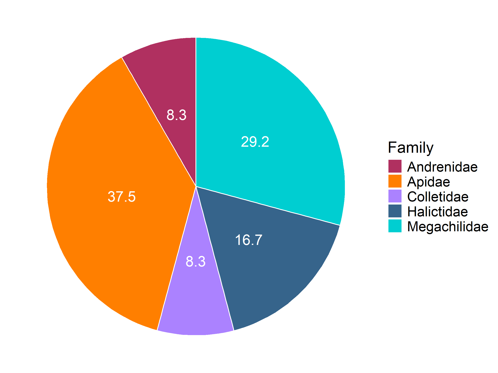

BeeSearch Pie Plots
================
Dr. Riley M. Anderson
May 23, 2025

  

- [Overview](#overview)
- [Species richness per family](#species-richness-per-family)
  - [As percentages:](#as-percentages)
  - [As counts:](#as-counts)
- [Individuals collected per family](#individuals-collected-per-family)
  - [As percentages:](#as-percentages-1)
  - [As counts:](#as-counts-1)
- [Genera per family](#genera-per-family)
  - [As percentages:](#as-percentages-2)
  - [As counts:](#as-counts-2)
  - [Session Information](#session-information)

## Overview

This analysis creates pie charts for 1) species richness per family, 2)
individuals collected per family, and 3) genera per family.

# Species richness per family

### As percentages:

<!-- -->

### As counts:

<!-- -->

# Individuals collected per family

### As percentages:

<!-- -->

### As counts:

<!-- -->

# Genera per family

### As percentages:

<!-- -->

### As counts:

<!-- -->

## Session Information

    R version 4.2.3 (2023-03-15 ucrt)
    Platform: x86_64-w64-mingw32/x64 (64-bit)
    Running under: Windows 10 x64 (build 19045)

    Matrix products: default

    locale:
    [1] LC_COLLATE=English_United States.utf8 
    [2] LC_CTYPE=English_United States.utf8   
    [3] LC_MONETARY=English_United States.utf8
    [4] LC_NUMERIC=C                          
    [5] LC_TIME=English_United States.utf8    

    attached base packages:
    [1] stats     graphics  grDevices utils     datasets  methods   base     

    other attached packages:
     [1] knitr_1.47      cowplot_1.1.3   lubridate_1.9.3 forcats_1.0.0  
     [5] stringr_1.5.1   dplyr_1.1.4     purrr_1.0.2     readr_2.1.5    
     [9] tidyr_1.3.1     tibble_3.2.1    ggplot2_3.5.1   tidyverse_2.0.0

    loaded via a namespace (and not attached):
     [1] Rcpp_1.0.12       highr_0.11        pillar_1.9.0      compiler_4.2.3   
     [5] tools_4.2.3       digest_0.6.35     timechange_0.3.0  evaluate_0.24.0  
     [9] lifecycle_1.0.4   gtable_0.3.5      pkgconfig_2.0.3   rlang_1.1.4      
    [13] cli_3.6.2         rstudioapi_0.16.0 ggrepel_0.9.5     yaml_2.3.8       
    [17] xfun_0.44         fastmap_1.2.0     withr_3.0.0       generics_0.1.3   
    [21] vctrs_0.6.5       hms_1.1.3         rprojroot_2.0.4   grid_4.2.3       
    [25] tidyselect_1.2.1  glue_1.7.0        R6_2.5.1          fansi_1.0.6      
    [29] rmarkdown_2.27    farver_2.1.2      tzdb_0.4.0        magrittr_2.0.3   
    [33] scales_1.3.0      htmltools_0.5.8.1 colorspace_2.1-0  labeling_0.4.3   
    [37] utf8_1.2.4        stringi_1.8.4     munsell_0.5.1    
