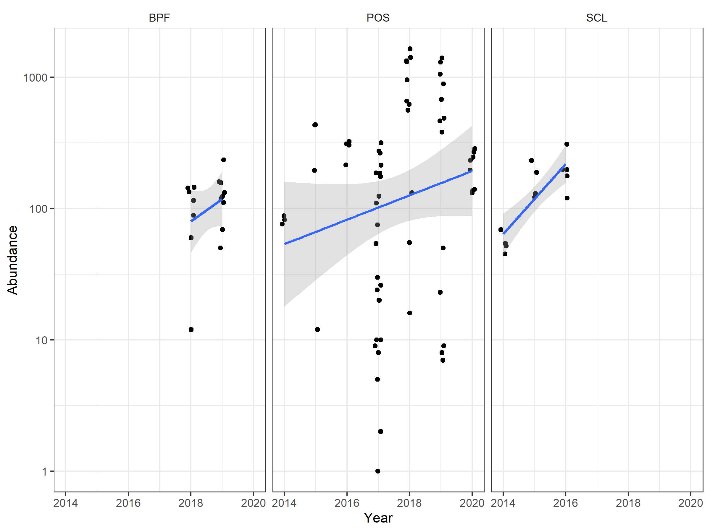
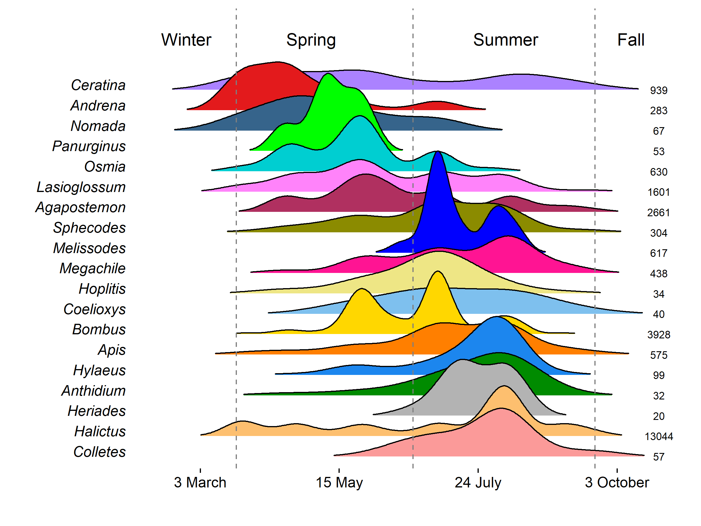
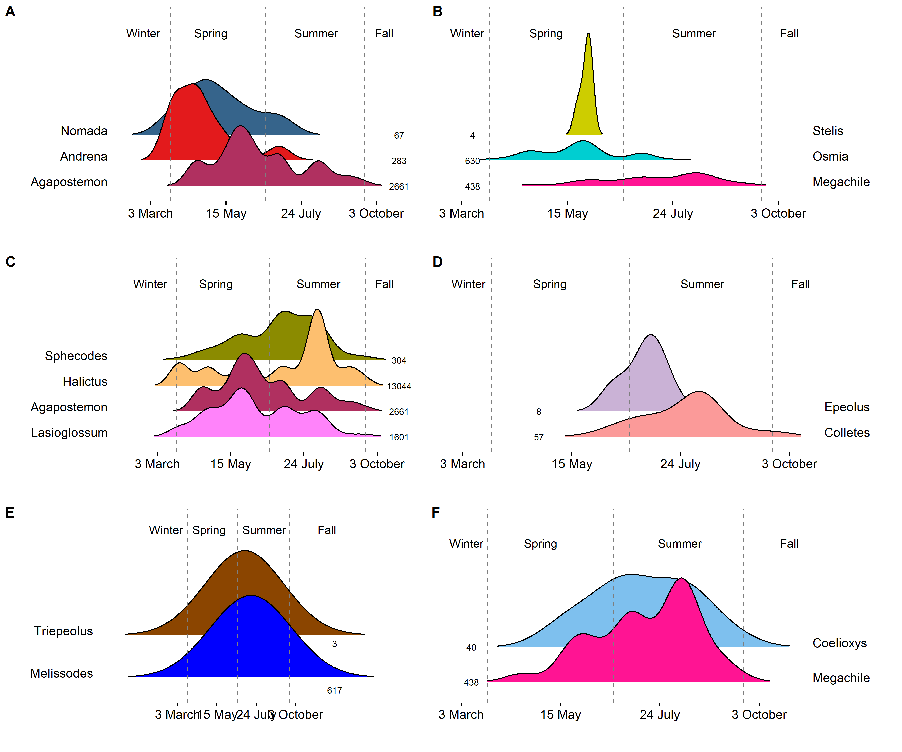
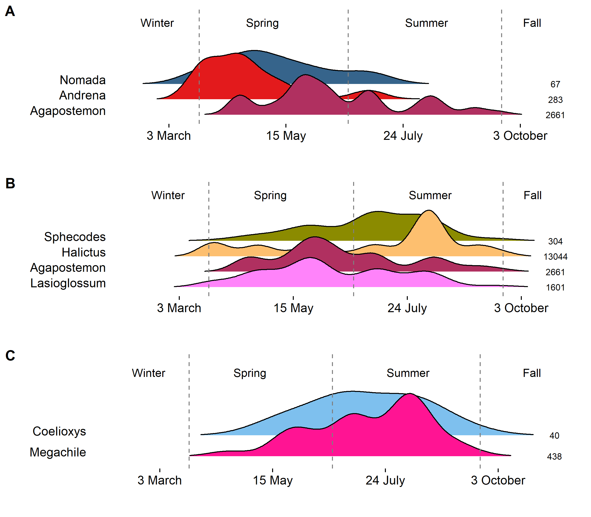
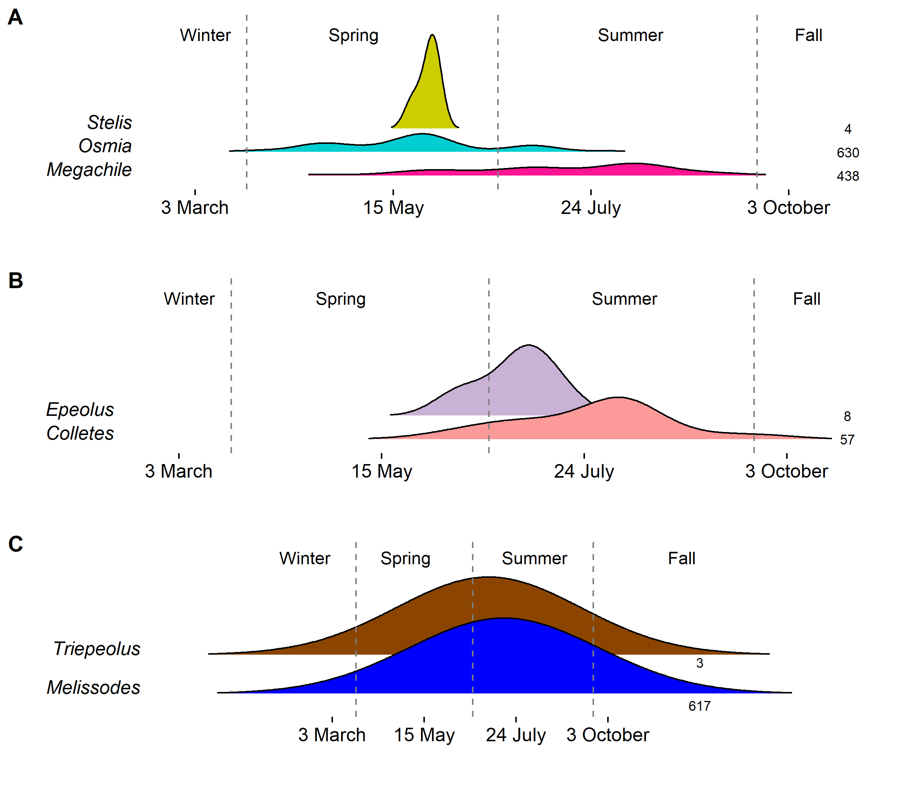
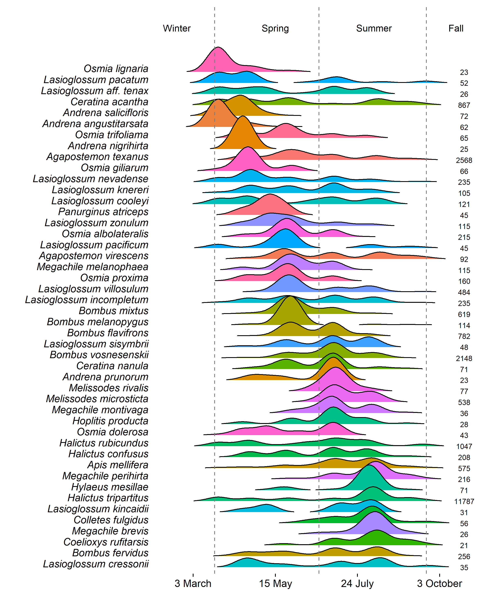
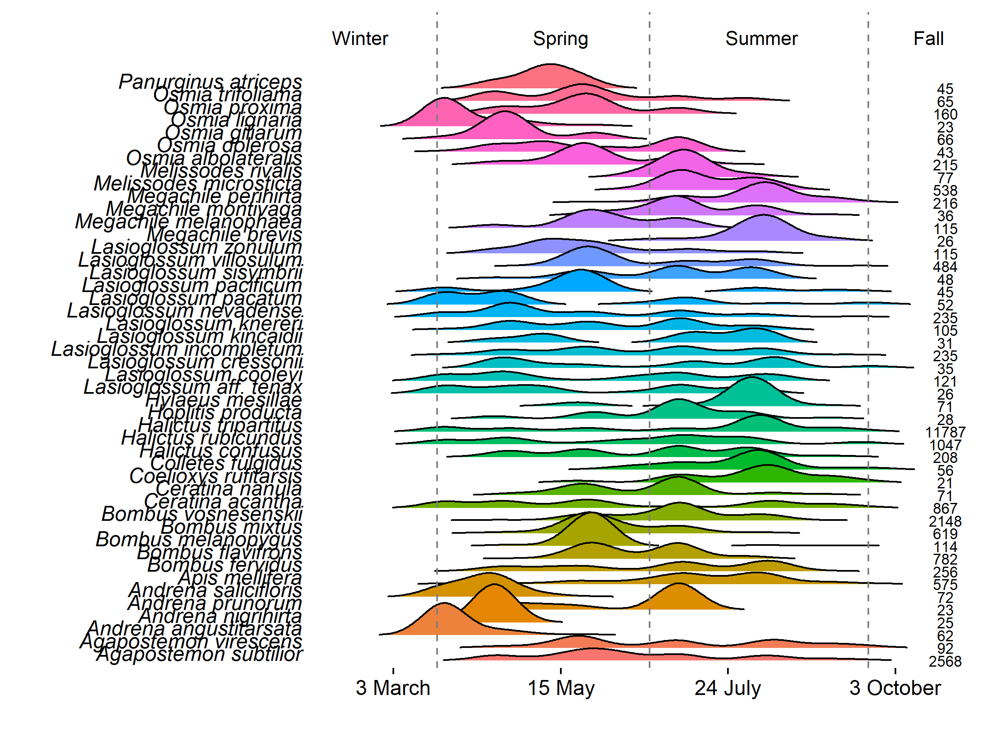
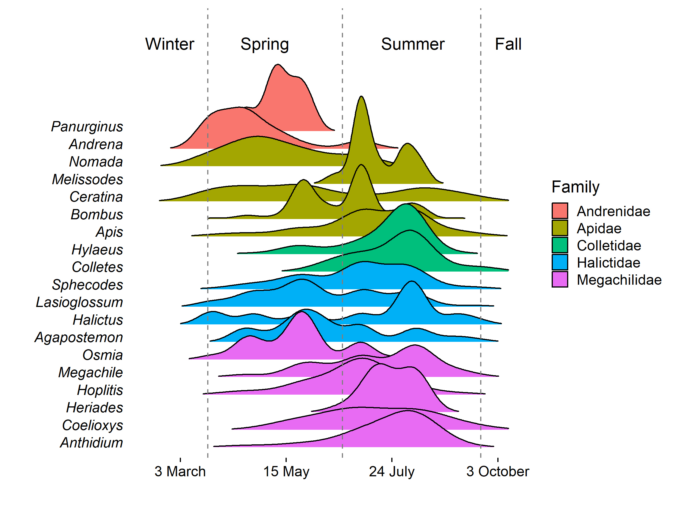

BeeSearch ridge plots
================
Dr. Riley M. Anderson
July 10, 2025

  

- [Overview](#overview)
  - [Summary of Results](#summary-of-results)
- [Abundance over time](#abundance-over-time)
- [Genus by time of year](#genus-by-time-of-year)
  - [Host-parasite ridges](#host-parasite-ridges)
  - [Parasite-host composite](#parasite-host-composite)
  - [Parasite-host composite (3 good
    combos)](#parasite-host-composite-3-good-combos)
  - [Parasite-host composite (3 bad
    combos)](#parasite-host-composite-3-bad-combos)
- [Species by time of year](#species-by-time-of-year)
- [Phenology by phylogeny](#phenology-by-phylogeny)
  - [Session Information](#session-information)

## Overview

This analysis compares the abundance of genera and species throughout
the season. All analyses use the full data set. That is, counts of each
species at each time point are the cumulative sum of all sites and all
years. Records also include net caught specimens and all morphospecies.

### Summary of Results

19 genera had 
20 records and these genera are shown for the genus level plot.
Additional plots for parasite-host combinations are shown without any
record cut-off. Sample size is included in each plot.

# Abundance over time

<!-- -->

# Genus by time of year

<!-- -->

**Genus-level seasonal distributions.** Density is estimated at the
genus level with Scott’s method for genera presumed univoltine, while
biased cross validation was used for genera presumed multivoltine.
Sample sizes displayed on the right are the total number of records for
each genera. Vertical dashed lines correspond to 21 March, 21 June, and
21 September.

### Host-parasite ridges

### Parasite-host composite

<!-- -->

**Genus-level seasonal distributions** for the parasites: A) Nomada, B)
Stelis, C) Sphecodes, D) Epeolus, E) Triepeolus, and F) Coelioxys.
Beneath each parasite genera are the presumed host genera. Density is
estimated at the genus level with Scott’s method for genera presumed
univoltine, while biased cross validation was used for genera presumed
multivoltine. Sample sizes displayed on the right (plots A, C, E) and
left (plots B, D, F) are the total number of records for each genera.
Vertical dashed lines correspond to 21 March, 21 June, and 21 September.

### Parasite-host composite (3 good combos)

<!-- -->

**Genus-level seasonal distributions** for the parasites: A) Nomada, B)
Sphecodes, and C) Coelioxys. Beneath each parasite genera are the
presumed host genera. Density is estimated at the genus level with
Scott’s method for genera presumed univoltine, while biased cross
validation was used for genera presumed multivoltine. Sample sizes
displayed on the right are the total number of records for each genera.
Vertical dashed lines correspond to 21 March, 21 June, and 21 September.

### Parasite-host composite (3 bad combos)

<!-- -->

**Genus-level seasonal distributions** for the parasites: A) Stelis, B)
Epeolus, and C) Triepeolus. Beneath each parasite genera are the
presumed host genera. Density is estimated at the genus level with
Scott’s method for genera presumed univoltine, while biased cross
validation was used for genera presumed multivoltine. Sample sizes
displayed on the right are the total number of records for each genera.
Vertical dashed lines correspond to 21 March, 21 June, and 21 September.
These parasites have low sample sizes limiting distributional
estimation.

# Species by time of year

    ## # A tibble: 35 × 2
    ##    Short.label.name             n
    ##    <chr>                    <int>
    ##  1 Nomada msp. 2016A_CABS       5
    ##  2 Nomada msp. 2016B_CABS       3
    ##  3 Nomada msp. 2016C_CABS      13
    ##  4 Nomada msp. 2016D_CABS       1
    ##  5 Nomada msp. 2016E_CABS       1
    ##  6 Nomada msp. 2016F_CABS       1
    ##  7 Nomada msp. 2017A_CABS       2
    ##  8 Nomada msp. 2019B_2_CABS     2
    ##  9 Nomada msp. 2019B_CABS       4
    ## 10 Nomada msp. 2023A_CABS      13
    ## 11 Nomada msp. 2023C_CABS       6
    ## 12 Nomada msp. 2023E_CABS       6
    ## 13 Nomada msp. 2023F_CABS       1
    ## 14 Nomada msp. 2023G_CABS       2
    ## 15 Nomada msp. 2023I_CABS       2
    ## 16 Nomada msp. 2023J_CABS       1
    ## 17 Osmia msp. BS0038            1
    ## 18 Osmia msp. BS0049            1
    ## 19 Osmia msp. BS0051            1
    ## 20 Osmia msp. BS0056            1
    ## 21 Osmia msp. BS0058            2
    ## 22 Sphecodes msp. BS0001       22
    ## 23 Sphecodes msp. BS0002       10
    ## 24 Sphecodes msp. BS0003      147
    ## 25 Sphecodes msp. BS0017       88
    ## 26 Sphecodes msp. BS0018       14
    ## 27 Sphecodes msp. BS0019        4
    ## 28 Sphecodes msp. BS0020        1
    ## 29 Sphecodes msp. BS0021        1
    ## 30 Sphecodes msp. BS0022        1
    ## 31 Sphecodes msp. BS0023        6
    ## 32 Sphecodes msp. BS0060        1
    ## 33 Sphecodes msp. BS0061        3
    ## 34 Sphecodes msp. BS0062        6
    ## 35 Triepeolus msp. BS0063       3

<!-- -->

<!-- -->

**Species-level seasonal distributions.** Density is estimated uniformly
across all species with Silverman’s method. Sample sizes displayed on
the right are the total number of records for each species. Species
displayed are those for which sample sizes were
 20. Vertical
dashed lines correspond to 21 March, 21 June, and 21 September.

# Phenology by phylogeny

<!-- -->

## Session Information

    R version 4.2.3 (2023-03-15 ucrt)
    Platform: x86_64-w64-mingw32/x64 (64-bit)
    Running under: Windows 10 x64 (build 22631)

    Matrix products: default

    locale:
    [1] LC_COLLATE=English_United States.utf8 
    [2] LC_CTYPE=English_United States.utf8   
    [3] LC_MONETARY=English_United States.utf8
    [4] LC_NUMERIC=C                          
    [5] LC_TIME=English_United States.utf8    

    attached base packages:
    [1] stats     graphics  grDevices utils     datasets  methods   base     

    other attached packages:
     [1] sjPlot_2.8.16   ggridges_0.5.6  knitr_1.47      cowplot_1.1.3  
     [5] lubridate_1.9.3 forcats_1.0.0   stringr_1.5.1   dplyr_1.1.4    
     [9] purrr_1.0.2     readr_2.1.5     tidyr_1.3.1     tibble_3.2.1   
    [13] ggplot2_3.5.1   tidyverse_2.0.0

    loaded via a namespace (and not attached):
     [1] tidyselect_1.2.1   sjlabelled_1.2.0   xfun_0.44          performance_0.12.0
     [5] splines_4.2.3      lattice_0.20-45    colorspace_2.1-0   vctrs_0.6.5       
     [9] generics_0.1.3     htmltools_0.5.8.1  yaml_2.3.8         mgcv_1.8-42       
    [13] utf8_1.2.4         rlang_1.1.4        pillar_1.9.0       glue_1.7.0        
    [17] withr_3.0.0        lifecycle_1.0.4    sjmisc_2.8.10      munsell_0.5.1     
    [21] gtable_0.3.5       evaluate_0.24.0    labeling_0.4.3     tzdb_0.4.0        
    [25] fastmap_1.2.0      datawizard_0.11.0  fansi_1.0.6        highr_0.11        
    [29] scales_1.3.0       ggeffects_1.6.0    farver_2.1.2       hms_1.1.3         
    [33] digest_0.6.35      stringi_1.8.4      insight_1.0.1      grid_4.2.3        
    [37] rprojroot_2.0.4    cli_3.6.2          tools_4.2.3        sjstats_0.19.0    
    [41] magrittr_2.0.3     pkgconfig_2.0.3    Matrix_1.5-3       timechange_0.3.0  
    [45] rmarkdown_2.27     rstudioapi_0.16.0  R6_2.5.1           nlme_3.1-162      
    [49] compiler_4.2.3    
