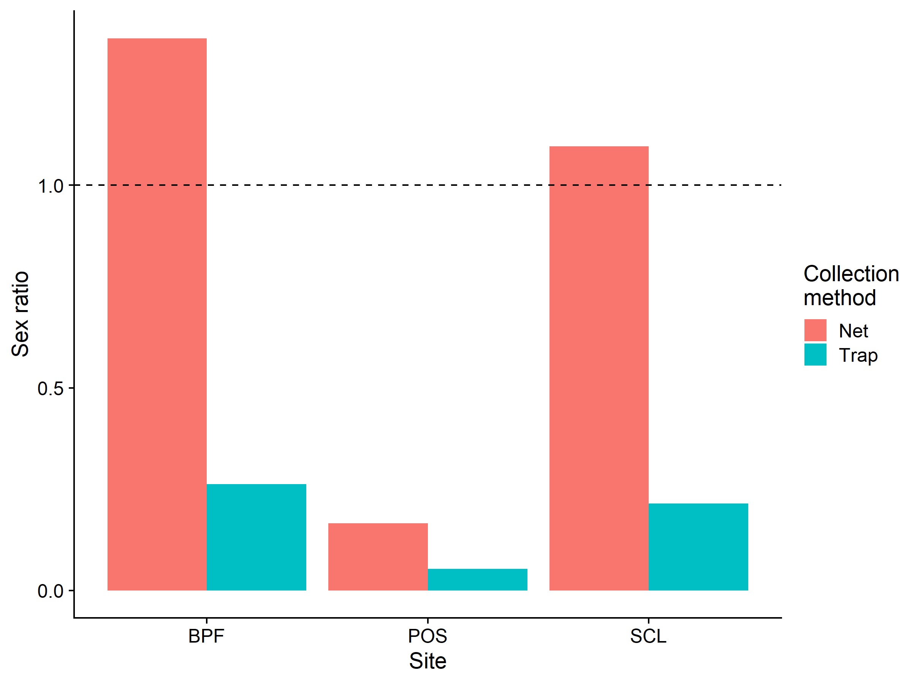
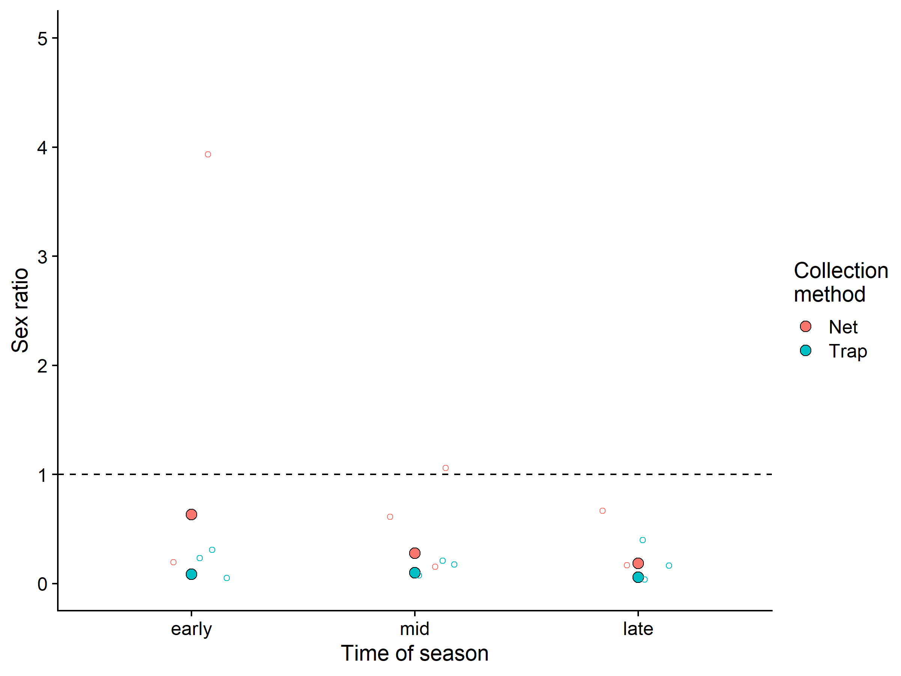

BeeSearch Sex Ratio Analyses
================
Dr. Riley M. Anderson
October 29, 2024

  

- [Overview](#overview)
  - [Summary of Results](#summary-of-results)
- [Sex ratio in trap vs. netting collection
  method:](#sex-ratio-in-trap-vs-netting-collection-method)
  - [Session Information](#session-information)

## Overview

This analysis looks at sex ratio bias in sweep net traps vs. blue vane
traps.

### Summary of Results

# Sex ratio in trap vs. netting collection method:

- Ratios \> 1 represent male bias

- Ratios \< 1 represent female bias

- Overall:

| Collection.Method | Male | female | male | sex_ratio |
|:------------------|-----:|-------:|-----:|----------:|
| T                 |    2 |  19330 | 1542 |      0.08 |
| N                 |    0 |   1659 |  406 |      0.24 |

- By site:

| Collection.Method | Site | Male | female | male | sex_ratio |
|:------------------|:-----|-----:|-------:|-----:|----------:|
| T                 | SCL  |    2 |   1465 |  314 |      0.21 |
| N                 | BPF  |    0 |     69 |   94 |      1.36 |
| N                 | POS  |    0 |   1538 |  255 |      0.17 |
| N                 | SCL  |    0 |     52 |   57 |      1.10 |
| T                 | BPF  |    0 |   1332 |  349 |      0.26 |
| T                 | POS  |    0 |  16533 |  879 |      0.05 |

<!-- --> **Sex
ratios of bees by site and collection method.** Points above the dashed
line represent male bias, whereas point below represent female bias.

- By season:

| Collection.Method | ToY   | Male | female | male | sex_ratio |
|:------------------|:------|-----:|-------:|-----:|----------:|
| T                 | mid   |    2 |   7221 |  721 |      0.10 |
| N                 | early |    0 |    128 |   81 |      0.63 |
| N                 | late  |    0 |   1084 |  201 |      0.19 |
| N                 | mid   |    0 |    447 |  124 |      0.28 |
| T                 | early |    0 |   4473 |  380 |      0.08 |
| T                 | late  |    0 |   7636 |  441 |      0.06 |

- By season and site:

| Collection.Method | ToY   | Site | Male | female | male | sex_ratio |
|:------------------|:------|:-----|-----:|-------:|-----:|----------:|
| T                 | mid   | SCL  |    2 |    713 |  125 |      0.18 |
| N                 | early | BPF  |    0 |     15 |   59 |      3.93 |
| N                 | early | POS  |    0 |    113 |   22 |      0.19 |
| N                 | late  | BPF  |    0 |     36 |   24 |      0.67 |
| N                 | late  | POS  |    0 |   1048 |  175 |      0.17 |
| N                 | mid   | BPF  |    0 |     18 |   11 |      0.61 |
| N                 | mid   | POS  |    0 |    377 |   58 |      0.15 |
| N                 | mid   | SCL  |    0 |     52 |   55 |      1.06 |
| T                 | early | BPF  |    0 |    203 |   47 |      0.23 |
| T                 | early | POS  |    0 |   3815 |  193 |      0.05 |
| T                 | early | SCL  |    0 |    455 |  140 |      0.31 |
| T                 | late  | BPF  |    0 |    346 |  138 |      0.40 |
| T                 | late  | POS  |    0 |   6993 |  254 |      0.04 |
| T                 | late  | SCL  |    0 |    297 |   49 |      0.16 |
| T                 | mid   | BPF  |    0 |    783 |  164 |      0.21 |
| T                 | mid   | POS  |    0 |   5725 |  432 |      0.08 |
| N                 | late  | SCL  |    0 |      0 |    2 |       Inf |

<!-- -->
**Sex ratios of bees collected by either net or trap across the sampling
season.** Points above the dashed line represent male bias, whereas
point below represent female bias. Early season (late March - mid May),
mid season (mid May to mid July), and late season (mid July - late
September) time windows in the sampling effort are shown. Large solid
points are sex ratios calculated at the season level. Small open points
are sex ratios calculated at the sub-site level within each season.
Small points are spread horizontally for visual clarity.

## Session Information

    R version 4.2.3 (2023-03-15 ucrt)
    Platform: x86_64-w64-mingw32/x64 (64-bit)
    Running under: Windows 10 x64 (build 19045)

    Matrix products: default

    locale:
    [1] LC_COLLATE=English_United States.utf8 
    [2] LC_CTYPE=English_United States.utf8   
    [3] LC_MONETARY=English_United States.utf8
    [4] LC_NUMERIC=C                          
    [5] LC_TIME=English_United States.utf8    

    attached base packages:
    [1] stats     graphics  grDevices utils     datasets  methods   base     

    other attached packages:
     [1] caret_6.0-94         randomForest_4.7-1.1 geosphere_1.5-18    
     [4] fossil_0.4.0         shapefiles_0.7.2     foreign_0.8-84      
     [7] maps_3.4.2           sp_2.1-4             knitr_1.47          
    [10] adespatial_0.3-23    vegan_2.6-6.1        lattice_0.20-45     
    [13] permute_0.9-7        cowplot_1.1.3        lubridate_1.9.3     
    [16] forcats_1.0.0        stringr_1.5.1        dplyr_1.1.4         
    [19] purrr_1.0.2          readr_2.1.5          tidyr_1.3.1         
    [22] tibble_3.2.1         ggplot2_3.5.1        tidyverse_2.0.0     

    loaded via a namespace (and not attached):
      [1] colorspace_2.1-0     seqinr_4.2-36        deldir_2.0-4        
      [4] class_7.3-21         rprojroot_2.0.4      rstudioapi_0.16.0   
      [7] proxy_0.4-27         farver_2.1.2         listenv_0.9.1       
     [10] prodlim_2023.08.28   fansi_1.0.6          xml2_1.3.6          
     [13] codetools_0.2-19     splines_4.2.3        ade4_1.7-22         
     [16] pROC_1.18.5          phylobase_0.8.12     cluster_2.1.4       
     [19] png_0.1-8            shiny_1.8.1.1        compiler_4.2.3      
     [22] httr_1.4.7           adegraphics_1.0-21   Matrix_1.5-3        
     [25] fastmap_1.2.0        cli_3.6.2            later_1.3.2         
     [28] s2_1.1.6             htmltools_0.5.8.1    prettyunits_1.2.0   
     [31] tools_4.2.3          igraph_2.0.3         gtable_0.3.5        
     [34] glue_1.7.0           reshape2_1.4.4       wk_0.9.1            
     [37] Rcpp_1.0.12          vctrs_0.6.5          spdep_1.3-5         
     [40] ape_5.8              nlme_3.1-162         iterators_1.0.14    
     [43] timeDate_4032.109    gower_1.0.1          xfun_0.44           
     [46] globals_0.16.3       adephylo_1.1-16      timechange_0.3.0    
     [49] mime_0.12            lifecycle_1.0.4      XML_3.99-0.16.1     
     [52] future_1.33.2        MASS_7.3-58.2        scales_1.3.0        
     [55] ipred_0.9-14         hms_1.1.3            promises_1.3.0      
     [58] parallel_4.2.3       RColorBrewer_1.1-3   yaml_2.3.8          
     [61] rpart_4.1.23         latticeExtra_0.6-30  stringi_1.8.4       
     [64] highr_0.11           foreach_1.5.2        e1071_1.7-14        
     [67] hardhat_1.4.0        boot_1.3-28.1        lava_1.8.0          
     [70] spData_2.3.1         rlang_1.1.4          pkgconfig_2.0.3     
     [73] rncl_0.8.7           evaluate_0.24.0      sf_1.0-16           
     [76] labeling_0.4.3       recipes_1.0.10       tidyselect_1.2.1    
     [79] parallelly_1.37.1    plyr_1.8.9           magrittr_2.0.3      
     [82] R6_2.5.1             generics_0.1.3       DBI_1.2.3           
     [85] pillar_1.9.0         withr_3.0.0          mgcv_1.8-42         
     [88] units_0.8-5          nnet_7.3-18          survival_3.5-3      
     [91] future.apply_1.11.2  crayon_1.5.2         uuid_1.2-0          
     [94] interp_1.1-6         KernSmooth_2.23-20   utf8_1.2.4          
     [97] tzdb_0.4.0           rmarkdown_2.27       jpeg_0.1-10         
    [100] progress_1.2.3       RNeXML_2.4.11        adegenet_2.1.10     
    [103] grid_4.2.3           data.table_1.15.4    ModelMetrics_1.2.2.2
    [106] digest_0.6.35        classInt_0.4-10      xtable_1.8-4        
    [109] httpuv_1.6.15        stats4_4.2.3         munsell_0.5.1       
